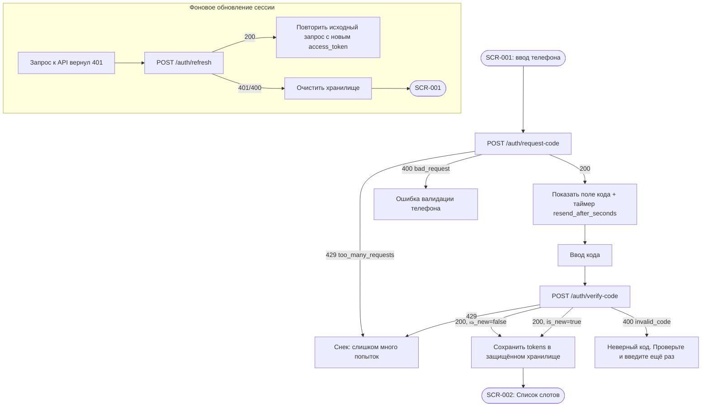

# Авторизация по телефону (OTP)

**ID:** LOGIC-001
**Тип:** Логика
**Домен:** 01. Авторизация
**Приоритет:** Critical
**Статус:** Черновик
**Функциональные блоки:** FB-AUTH-001, FB-AUTH-002, FB-AUTH-003

---

## История изменений

| Релиз | ТЗ | Описание изменений |
|-------|-----|-------------------|
| — | — | Первоначальная документация |

---

## Входные данные

| Название | Тип | Возможные значения | Описание |
|----------|-----|---------------------|----------|
| `access_token` | Защищённое хранилище | JWT-строка | Текущий access-токен |
| `refresh_token` | Защищённое хранилище | JWT-строка | Токен обновления сессии |
| `session_state` | Состояние | `anonymous`, `authenticated` | Признак наличия активной сессии |

---

## Обзор

Единая логика входа без пароля: подтверждение номера телефона одноразовым SMS-кодом,
выпуск пары JWT-токенов, хранение и автоматическое обновление сессии, выход из аккаунта.
Используется на [SCR-001](../screens/SCR-001-registration.md) и как сквозной механизм
на всех авторизованных экранах (проверка/обновление токена перед любым запросом).

### User Story

> Как клиент картинг-центра, я хочу войти по номеру телефона без пароля,
> чтобы быстро попасть к записи на заезд, стоя у трассы.

### Бизнес-ценность

- Минимальный порог входа — меньше отказов на старте воронки записи (P3).
- Нет паролей — нет восстановления доступа, нет службы поддержки по сбросу пароля.
- Единая точка правды о личности клиента для привязки броней и оценок (NFR-6).

---

## Точки применения

| Экран/Компонент | Элемент/Триггер | Условие |
|-----------------|------------------|---------|
| [SCR-001 Регистрация / Вход](../screens/SCR-001-registration.md) | Кнопка «Получить код» / «Подтвердить» | Всегда |
| Все экраны АЗ | Interceptor исходящих запросов | `access_token` истёк (401 или `exp` близко) |
| Экран настроек/профиля (вне текущей поставки, задел) | «Выйти» | Всегда |

---

## Флоу

---

## Описание логики

### Шаг 1: Запрос кода

Пользователь вводит телефон на [SCR-001](../screens/SCR-001-registration.md) шаг 1.
Клиент вызывает `POST /auth/request-code` с телефоном в формате E.164 (`^\+[1-9]\d{1,14}$`).
При успехе UI переключается на шаг 2 (поле кода) и запускает таймер повторной отправки
на `resend_after_seconds` (из ответа, обычно 60 с). Код действителен `ttl_seconds`
(обычно 300 с) — таймер жизни кода на UI не обязателен, но повторная отправка блокируется
до истечения `resend_after_seconds`.

### Шаг 2: Подтверждение кода

Пользователь вводит код. Клиент вызывает `POST /auth/verify-code` с телефоном и кодом.
При успехе (200) сервер возвращает `tokens` (access + refresh), `client` и `is_new`.

- Токены сохраняются в защищённом хранилище устройства (Keychain/Keystore), не в обычном
  кэше (NFR-6).
- `is_new = true` означает пустое `client.name` — в текущей поставке имя не запрашивается
  отдельным экраном (вне скоупа §«Экраны»); допустимо оставить `name` пустым или предложить
  заполнение через `PATCH /profile` при первой необходимости (вне скоупа текущих ТЗ на экраны).
- После сохранения токенов — переход на [SCR-002](../screens/SCR-002-slot-list.md).

### Шаг 3: Хранение и автообновление сессии

Все запросы АЗ идут через единый HTTP-interceptor:

1. Перед отправкой — если `access_token` истёк или истекает в ближайшие N секунд, сначала
   вызывается `POST /auth/refresh` с текущим `refresh_token`.
2. Если сервер уже вернул `401 Unauthorized` на прикладной запрос — interceptor один раз
   пытается `POST /auth/refresh`, затем повторяет исходный запрос с новым `access_token`.
3. Если `refresh` тоже вернул `401`/`400` — сессия считается недействительной: хранилище
   очищается, пользователь перенаправляется на [SCR-001](../screens/SCR-001-registration.md).
4. Только один `refresh`-запрос допускается одновременно (single-flight) — параллельные 401
   не должны порождать несколько `refresh`-вызовов.

### Шаг 4: Выход

`POST /auth/logout` инвалидирует refresh-токен на сервере; клиент в любом случае (успех/ошибка
сети) очищает локальное хранилище токенов и переходит на SCR-001. Push-токен предварительно
отвязывается через `DELETE /auth/push-tokens` (см. [LOGIC-006](LOGIC-006-push-notifications.md)).

---

## API запросы

### POST /auth/request-code

**Триггер:** Тап «Получить код» на SCR-001, шаг 1.

**Headers:** без авторизации (`security: []`).

**Параметры/Body:**

| Параметр | Тип | Описание | Значение/Источник |
|----------|-----|----------|---------------------|
| `phone` | string | Телефон в формате E.164 | Поле ввода, нормализуется до `+7XXXXXXXXXX` |

**Обработка ответа:**

| Результат | Действие |
|-----------|----------|
| Загрузка | Лоадер на кнопке «Получить код» |
| Успех (200) | Переход к шагу 2, старт таймера `resend_after_seconds` |
| Ошибка 400 | Текст ошибки под полем телефона («Похоже, номер введён не полностью») |
| Ошибка 429 | Снек "Слишком много попыток. Повторите позже" |
| Ошибка 5xx/сеть | Снек "Произошла ошибка. Попробуйте позже" / "Нет соединения…" |

### POST /auth/verify-code

**Триггер:** Тап «Подтвердить» на SCR-001, шаг 2.

**Параметры/Body:**

| Параметр | Тип | Описание | Значение/Источник |
|----------|-----|----------|---------------------|
| `phone` | string | Телефон, введённый на шаге 1 | Состояние экрана |
| `code` | string | 4–6 цифр | Поле ввода кода |

**Обработка ответа:**

| Результат | Действие |
|-----------|----------|
| Загрузка | Лоадер на кнопке «Подтвердить» |
| Успех (200) | Сохранить `tokens`/`client` → SCR-002 |
| Ошибка 400 (`invalid_code`) | «Неверный код. Проверьте и введите ещё раз» под полем кода |
| Ошибка 429 | Снек "Слишком много попыток. Повторите позже" |
| Ошибка 5xx/сеть | Снек стандартный |

### POST /auth/refresh

**Триггер:** Истёкший access-токен перед запросом / 401 от прикладного эндпоинта.

**Параметры/Body:**

| Параметр | Тип | Описание | Значение/Источник |
|----------|-----|----------|---------------------|
| `refresh_token` | string | Текущий refresh-токен | Защищённое хранилище |

**Обработка ответа:**

| Результат | Действие |
|-----------|----------|
| Успех (200) | Заменить пару токенов в хранилище, повторить исходный запрос |
| Ошибка 400/401 | Очистить хранилище → редирект на SCR-001 |
| Ошибка 5xx/сеть | Исходный запрос завершается ошибкой сети; сессия не сбрасывается (повтор при следующем действии) |

### POST /auth/logout

**Триггер:** Действие «Выйти» (вне текущей поставки экранов, задел на будущее).

**Обработка ответа:**

| Результат | Действие |
|-----------|----------|
| Успех (204) / любая ошибка | Очистить локальное хранилище токенов и push-токен → SCR-001 |

---

## Локальное хранение

| Ключ | Тип хранения | Описание |
|------|--------------|----------|
| `access_token` | Защищённое хранилище | Короткоживущий JWT, `expires_in` (обычно 900 с) |
| `refresh_token` | Защищённое хранилище | Для ротации сессии |
| `client_id`, `client_phone` | Локальный кэш | Для отображения в UI без лишних запросов к `/profile` |

---

## Связанные требования

### Функциональные (REQ-FUNC-*)

| ID | Название | Приоритет |
|----|----------|-----------|
| REQ-FUNC-AUTH-001 | Вход по телефону + SMS OTP, без пароля | Critical |
| REQ-FUNC-AUTH-002 | Автоматическое обновление сессии по refresh-токену | Critical |
| REQ-FUNC-AUTH-003 | Выход из аккаунта с инвалидацией сессии | Medium |

### Интеграции (REQ-INT-*)

| ID | Название | Приоритет |
|----|----------|-----------|
| REQ-INT-AUTH-001 | `POST /auth/request-code`, `/verify-code`, `/refresh`, `/logout` | Critical |

### Данные (REQ-DATA-*)

| ID | Название | Приоритет |
|----|----------|-----------|
| REQ-DATA-AUTH-001 | Токены — только в защищённом хранилище (Keychain/Keystore) | Critical |

---

## Критерии приёмки

| ID | Критерий |
|----|----------|
| AC-001 | **Дано** валидный телефон, **Когда** тап «Получить код», **Тогда** экран переходит к вводу кода и запускает таймер повтора |
| AC-002 | **Дано** верный код, **Когда** тап «Подтвердить», **Тогда** токены сохранены и открыт SCR-002 |
| AC-003 | **Дано** неверный код, **Когда** тап «Подтвердить», **Тогда** показана ошибка «Неверный код…», поле кода не сбрасывается |
| AC-004 | **Дано** истёкший access-токен, **Когда** любой запрос АЗ, **Тогда** запрос предваряется/повторяется после успешного `refresh` без видимого сбоя для пользователя |
| AC-005 | **Дано** `refresh` вернул 401, **Когда** это происходит, **Тогда** локальная сессия очищается и открывается SCR-001 |
| AC-006 | **Дано** 429 от `request-code`/`verify-code`, **Когда** это происходит, **Тогда** показан снек о превышении числа попыток без сброса введённых данных |

---

## Обработка ошибок

| Тип ошибки | Контекст | Действие |
|------------|----------|----------|
| `invalid_code` (400) | `verify-code` | Инлайн-ошибка под полем кода, фокус остаётся в поле |
| `too_many_requests` (429) | `request-code`/`verify-code` | Снек, кнопка остаётся, повтор доступен по истечении `resend_after_seconds` |
| `unauthorized` (401) на `refresh` | Фоновое обновление | Тихий логаут → SCR-001 (без снека, чтобы не пугать пользователя посреди действия) |
| Сеть недоступна | Любой шаг | Снек "Нет соединения. Проверьте подключение к интернету", состояние формы сохраняется |
