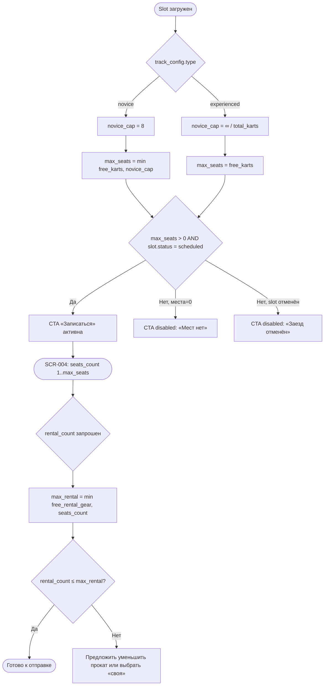

# Расчёт доступности мест и проката экипировки

**ID:** LOGIC-002
**Тип:** Логика
**Домен:** 02. Заезды
**Приоритет:** Critical
**Статус:** Черновик
**Функциональные блоки:** FB-SLOTS-002, FB-BOOKING-001

---

## История изменений

| Релиз | ТЗ | Описание изменений |
|-------|-----|-------------------|
| — | — | Первоначальная документация |

---

## Входные данные

| Название | Тип | Возможные значения | Описание |
|----------|-----|---------------------|----------|
| `slot.track_config.type` | Кэш (из `Slot`) | `novice`, `experienced` | Определяет потолок мест для новичковой конфигурации |
| `slot.free_karts` | Кэш (из `Slot`) | целое ≥ 0 | Свободные карты по данным сервера на момент загрузки |
| `slot.free_rental_gear` | Кэш (из `Slot`) | целое ≥ 0 | Свободные комплекты проката на момент загрузки |

---

## Обзор

Единая формула вычисления **максимально допустимого числа мест** для записи и **максимально
допустимого числа прокатных комплектов**, отображаемая клиенту на [SCR-003](../screens/SCR-003-slot-card.md)
и используемая для локальной валидации степпера на [SCR-004](../screens/SCR-004-booking.md).
Финальную проверку и атомарность всегда выполняет сервер при `POST /bookings`
(P6, R-004) — клиентский расчёт носит справочный/UX характер и не гарантирует бронь.

### User Story

> Как клиент, я хочу видеть точное число мест, которое я могу забронировать,
> чтобы не тратить время на попытку записи, заведомо обречённую на отказ.

### Бизнес-ценность

- Меньше отказов `409 slot_full` на этапе оформления записи — прозрачные лимиты заранее.
- Явное разделение фонда «места» и фонда «прокат» отражает бизнес-правило заказчика
  (новичковые заезды ≤ 8 человек, часть картов без проката).

---

## Точки применения

| Экран/Компонент | Элемент/Триггер | Условие |
|-----------------|------------------|---------|
| [SCR-003 Карточка слота](../screens/SCR-003-slot-card.md) | Отображение «Свободно N из M», доступность CTA «Записаться» | Всегда |
| [SCR-004 Оформление записи](../screens/SCR-004-booking.md) | Степпер «Мест», переключатели «Своя/Прокат» на место | Всегда |

---

## Флоу



---

## Описание логики

### Шаг 1: Лимит мест (`max_seats`)

```
novice_cap  = 8                          // потолок новичковой конфигурации (бриф Дениса)
max_seats   = track_config.type == "novice"
              ? min(slot.free_karts, novice_cap)
              : slot.free_karts
```

`total_karts` слота (≤ 14) уже учтён сервером в `free_karts`; клиент не переопределяет его,
а лишь дополнительно ограничивает `novice_cap` для новичковой конфигурации, как того требует
домен («на новичковые заезды больше 8 человек не ставим»).

### Шаг 2: Лимит проката (`max_rental`)

```
max_rental = min(slot.free_rental_gear, seats_count)
```

Прокат не может превышать число выбранных мест и не может превышать общий свободный фонд
проката слота. Своя экипировка фонд не расходует —
на UI выбор идёт «по месту» (своя/прокат), но перед отправкой на сервер агрегируется в
единое число `rental_gear_count = count(мест с «прокат»)`.

### Шаг 3: Доступность CTA «Записаться» (SCR-003)

CTA активна, если одновременно: `slot.status == "scheduled"` и `max_seats > 0`. Иначе —
disabled с подписью «Мест нет» (если `max_seats == 0` при `scheduled`) или «Заезд отменён»
(если `slot.status == "cancelled"`).

### Шаг 4: Валидация степпера мест (SCR-004)

Степпер «Мест» ограничен диапазоном `[1, max_seats]`. При достижении `max_seats` кнопка «+»
блокируется без ошибки (не отдельное сообщение, а просто неактивное состояние).

### Шаг 5: Валидация переключателей экипировки (SCR-004)

При попытке выбрать «Прокат» для очередного места, когда уже выбрано `max_rental` мест с
прокатом, переключатель для нового места блокируется в состоянии «Своя», и рядом со счётчиком
«Прокат доступно: N» показывается 0. Ошибка на экране не показывается заранее — сервер
дополнительно валидирует при отправке (см. [LOGIC-003](LOGIC-003-create-booking.md), `409
gear_unavailable`), т.к. данные могли устареть с момента открытия SCR-003/SCR-004.

---

## API запросы

> Логика не выполняет собственных запросов — использует данные, уже загруженные экранами
> [SCR-003](../screens/SCR-003-slot-card.md#используемые-запросы) (`GET /slots/{slotId}`)
> и [SCR-004](../screens/SCR-004-booking.md#используемые-запросы) (тот же `Slot` из состояния
> перехода). Расхождение данных на момент отправки обрабатывается сервером при
> `POST /bookings` — см. [LOGIC-003](LOGIC-003-create-booking.md).

---

## Связанные требования

### Функциональные (REQ-FUNC-*)

| ID | Название | Приоритет |
|----|----------|-----------|
| REQ-FUNC-BOOK-001 | Лимит мест = min(свободные карты, потолок новичковой конфигурации) | Critical |
| REQ-FUNC-BOOK-002 | Независимый лимит проката ≤ свободный фонд экипировки | Critical |
| REQ-FUNC-BOOK-003 | Своя экипировка не расходует прокатный фонд | Critical |

---

## Критерии приёмки

| ID | Критерий |
|----|----------|
| AC-001 | **Дано** `track_config.type = novice`, `free_karts = 10`, **Когда** расчёт `max_seats`, **Тогда** `max_seats = 8` |
| AC-002 | **Дано** `track_config.type = experienced`, `free_karts = 10`, **Когда** расчёт `max_seats`, **Тогда** `max_seats = 10` |
| AC-003 | **Дано** `free_rental_gear = 3`, `seats_count = 5`, **Когда** расчёт `max_rental`, **Тогда** `max_rental = 3` |
| AC-004 | **Дано** `max_seats = 0`, **Когда** отображение SCR-003, **Тогда** CTA «Записаться» disabled с текстом «Мест нет» |

### Граничные условия

| ID | Критерий |
|----|----------|
| AC-E01 | **Дано** `free_karts = 0` и `slot.status = scheduled`, **Когда** открытие SCR-003, **Тогда** карточка отображается, CTA disabled («Мест нет»), запись невозможна |
| AC-E02 | **Дано** данные о доступности устарели между загрузкой SCR-003 и отправкой SCR-004, **Когда** сервер отклоняет запрос (`409`), **Тогда** UI обновляет `free_seats`/`free_rental_gear` из тела ошибки (`details`) без повторного полного релоада экрана |
