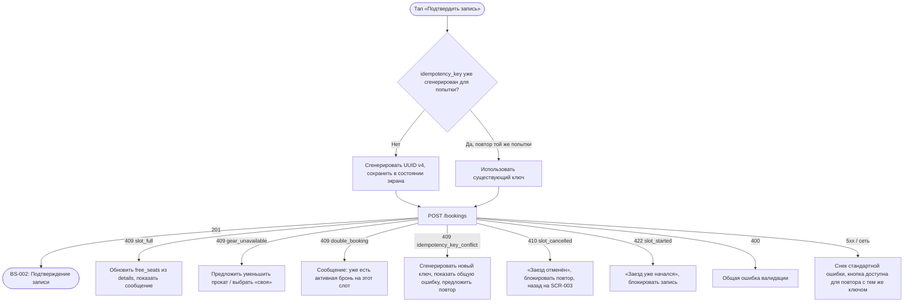

# Создание брони

**ID:** LOGIC-003
**Тип:** Логика
**Домен:** 03. Запись
**Приоритет:** Critical
**Функциональные блоки:** FB-BOOKING-002
**Статус:** Черновик

---

## История изменений

| Релиз | ТЗ | Описание изменений |
|-------|-----|-------------------|
| — | — | Первоначальная документация |

---

## Входные данные

| Название | Тип | Возможные значения | Описание |
|----------|-----|---------------------|----------|
| `idempotency_key` | Состояние (генерируется при входе на экран) | UUID v4 | Один ключ на одну попытку записи |

---

## Обзор

Отправка запроса на бронирование заезда с параметрами мест и проката, обработка успеха и
всех бизнес-конфликтов (переполнение, нехватка проката, отменённый слот, двойная бронь).
Единственная точка записи клиента на слот — используется на
[SCR-004](../screens/SCR-004-booking.md).

### User Story

> Как клиент, я хочу подтвердить запись одним действием и понятно узнать,
> если что-то изменилось (места закончились), чтобы не гадать, прошла ли бронь.

### Бизнес-ценность

- Гарантия «0 двойных броней» на стороне сервера (R-004) — клиент лишь корректно
  обрабатывает отказ.
- Idempotency-Key защищает от двойной оплаты/двойной брони при повторной отправке (плохая
  сеть, двойной тап) — NFR-9.

---

## Точки применения

| Экран/Компонент | Элемент/Триггер | Условие |
|-----------------|------------------|---------|
| [SCR-004 Оформление записи](../screens/SCR-004-booking.md) | Кнопка «Подтвердить запись» | Всегда |

---

## Флоу

---

## Описание логики

### Шаг 1: Генерация Idempotency-Key

При первом тапе «Подтвердить запись» в рамках текущего посещения SCR-004 генерируется
`Idempotency-Key` (UUID v4) и сохраняется в состоянии экрана. Повторные тапы (в т.ч. после
временной сетевой ошибки — `5xx`/таймаут) **переиспользуют тот же ключ**, чтобы сервер
распознал повтор той же попытки и не создал вторую бронь. Новый ключ генерируется только
если пользователь **изменил параметры** запроса (число мест/проката) — это уже новая попытка.

### Шаг 2: Отправка запроса

`POST /bookings` с `slot_id`, `seats_count`, `rental_gear_count` и заголовком
`Idempotency-Key`. Кнопка «Подтвердить запись» блокируется на время запроса, показывается
лоадер.

### Шаг 3: Обработка успеха

`201 Created` возвращает объект `Booking` (включая рассчитанный сервером `price_total`).
Клиент передаёт этот объект в [BS-002](../screens/BS-002-booking-success.md) для отображения
сводки. Локальный кэш «Мои брони» инвалидируется/обновляется.

### Шаг 4: Обработка бизнес-конфликтов (409/410/422)

| Код | `code` в теле | Действие UI |
|-----|----------------|-------------|
| 409 | `slot_full` | Сообщение «Свободных мест больше нет», значения `details.free_karts` используются, чтобы обновить локальное состояние слота (в т.ч. занизить степпер, если текущий `seats_count` больше нового `free_karts`); пользователь может скорректировать число мест и повторить (новый ключ) |
| 409 | `gear_unavailable` | Сообщение с `details.free_rental_gear`; предложить уменьшить `rental_gear_count` или переключить часть мест на «своя» |
| 409 | `double_booking` | «У вас уже есть активная запись на этот заезд» — CTA ведёт на SCR-005/SCR-006 существующей брони (если `booking_id` не возвращается явно — просто на SCR-005) |
| 409 | `idempotency_key_conflict` | Технический случай (тот же ключ, другое тело) — практически не должен происходить при корректной реализации шага 1; общий снек ошибки + сгенерировать новый ключ перед следующей попыткой |
| 410 | `slot_cancelled` | «Заезд отменён администрацией» — блокировать дальнейшие попытки, кнопка «Назад к заездам» → SCR-002 |
| 422 | `slot_started` | «Заезд уже начался, операция недоступна» — блокировать запись |
| 400 | `bad_request` | Общая ошибка валидации параметров — снек с `message` |

### Шаг 5: Сетевые и серверные ошибки

`5xx` и отсутствие сети — стандартный снек (foundations §6), кнопка «Подтвердить запись»
остаётся активной для повтора **с тем же Idempotency-Key** (см. Шаг 1).

---

## API запросы

### POST /bookings

**Тип:** REST
**Метод:** POST
**Спецификация:** `openapi.yaml` → `createBooking`

**Триггер:** Тап «Подтвердить запись» на SCR-004.

**Заголовки:**

| Заголовок | Обязательность | Описание |
|-----------|-----------------|----------|
| `Authorization` | Да | `Bearer <access_token>` |
| `Idempotency-Key` | Да | UUID v4, см. Шаг 1 |

**Параметры/Body:**

| Параметр | Тип | Обязательность | Источник | Описание |
|----------|-----|-----------------|----------|----------|
| `slot_id` | string(uuid) | Да | Параметр перехода с SCR-003 | Идентификатор слота |
| `seats_count` | integer | Да | Степпер «Мест» на SCR-004 | 1..max_seats (см. LOGIC-002) |
| `rental_gear_count` | integer | Да | Агрегат переключателей «Прокат» по местам | 0..seats_count |

**Обработка ответа:**

| Результат | Условие | UI-реакция |
|-----------|---------|------------|
| Загрузка | — | Лоадер на кнопке «Подтвердить запись», блокировка повторного тапа |
| Успех (201) | — | Переход в [BS-002](../screens/BS-002-booking-success.md) с данными `Booking` |
| 409 `slot_full`/`gear_unavailable`/`double_booking`/`idempotency_key_conflict` | — | Сообщение на экране SCR-004 согласно таблице выше |
| 410 `slot_cancelled` | — | Блокирующее сообщение + возврат к SCR-002 |
| 422 `slot_started` | — | Блокирующее сообщение |
| 400 | — | Снек с `message` из ответа |
| 5xx | — | Снек "Произошла ошибка. Попробуйте позже" |
| Сеть | Нет соединения | Снек "Нет соединения. Проверьте подключение к интернету", кнопка доступна для повтора |

---

## Связанные требования

### Функциональные (REQ-FUNC-*)

| ID | Название | Приоритет |
|----|----------|-----------|
| REQ-FUNC-BOOK-004 | Создание брони с атомарной проверкой доступности на сервере | Critical |
| REQ-FUNC-BOOK-005 | Защита от дублирования брони через Idempotency-Key | Critical |
| REQ-FUNC-BOOK-006 | Обработка всех бизнес-конфликтов записи (см. таблицу шага 4) | Critical |

### Интеграции (REQ-INT-*)

| ID | Название | Приоритет |
|----|----------|-----------|
| REQ-INT-BOOK-001 | `POST /bookings` (createBooking) | Critical |

---

## Критерии приёмки

### Позитивные сценарии

| ID | Критерий | Приоритет |
|----|----------|-----------|
| AC-001 | **Дано** валидные `seats_count`/`rental_gear_count` и доступные места, **Когда** тап «Подтвердить запись», **Тогда** создаётся бронь и открывается BS-002 | P0 |
| AC-002 | **Дано** временная сетевая ошибка на первой попытке, **Когда** повторный тап «Подтвердить запись», **Тогда** используется тот же Idempotency-Key и не создаётся вторая бронь | P0 |

### Негативные сценарии

| ID | Критерий | Приоритет |
|----|----------|-----------|
| AC-N01 | **Дано** места закончились между открытием SCR-004 и отправкой, **Когда** сервер вернул `409 slot_full`, **Тогда** показано сообщение и обновлены актуальные `free_karts` | P0 |
| AC-N02 | **Дано** слот отменён администрацией к моменту отправки, **Когда** сервер вернул `410`, **Тогда** запись заблокирована, пользователь возвращён к списку слотов | P0 |
| AC-N03 | **Дано** нет сети, **Когда** тап «Подтвердить запись», **Тогда** показан снек об отсутствии соединения, форма не сбрасывается | P1 |

### Граничные условия

| ID | Критерий | Приоритет |
|----|----------|-----------|
| AC-E01 | **Дано** пользователь изменил `seats_count` после неудачной попытки, **Когда** повторная отправка, **Тогда** генерируется новый Idempotency-Key | P1 |
