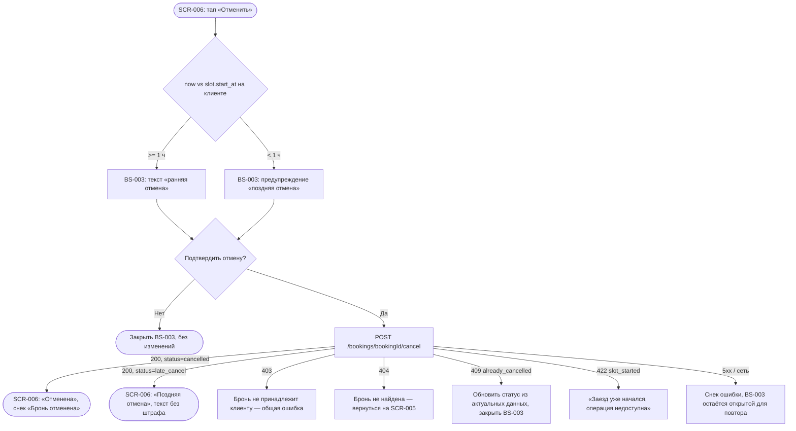

# Отмена брони

**ID:** LOGIC-004
**Тип:** Логика
**Домен:** 04. Мои брони
**Приоритет:** Critical
**Функциональные блоки:** FB-BOOKING-003
**Статус:** Черновик

---

## История изменений

| Релиз | ТЗ | Описание изменений |
|-------|-----|-------------------|
| — | — | Первоначальная документация |

---

## Входные данные

| Название | Тип | Возможные значения | Описание |
|----------|-----|---------------------|----------|
| `booking.slot.start_at` | Кэш (из `Booking`) | ISO date-time | Используется для отображения предупреждения «поздняя отмена» до отправки запроса |

---

## Обзор

Отмена активной брони клиентом. Тип отмены (ранняя/поздняя) окончательно определяет **сервер**
по разнице между моментом запроса и `slot.start_at`; клиент лишь заранее показывает
предупреждение на основе локально известного времени старта, чтобы не удивлять пользователя
результатом. Используется на [SCR-006](../screens/SCR-006-booking-details.md) через
[BS-003](../screens/BS-003-cancel-confirm.md).

### User Story

> Как клиент, я хочу отменить запись и заранее понимать последствия поздней отмены,
> чтобы принять решение осознанно, без штрафов и сюрпризов.

### Бизнес-ценность

- Прозрачное правило «1 час» снижает число неявок без начисления штрафов (P4, домен).
- Чёткая граница ответственности «сервер решает финально» исключает рассинхрон часов
  клиента и сервера как источник спора.

---

## Точки применения

| Экран/Компонент | Элемент/Триггер | Условие |
|-----------------|------------------|---------|
| [SCR-006 Детали брони](../screens/SCR-006-booking-details.md) | Кнопка «Отменить» | `booking.status = active` |
| [BS-003 Подтверждение отмены](../screens/BS-003-cancel-confirm.md) | Кнопка «Подтвердить отмену» | Всегда (шторка открыта) |

---

## Флоу



---

## Описание логики

### Шаг 1: Локальное предупреждение (до запроса)

На [BS-003](../screens/BS-003-cancel-confirm.md) при открытии клиент сравнивает текущее время
устройства с `booking.slot.start_at`:

```
is_early_locally = (slot.start_at - now) >= 1 час
```

Если `is_early_locally = true` — показывается общий текст правила отмены (foundations §6).
Если `false` — дополнительно показывается блок «⚠ Поздняя отмена: место может остаться
занятым» и «Штраф не взимается». Это только предварительная подсказка UI — окончательное
решение принимает сервер в момент запроса (часы устройства могут отставать/спешить).

### Шаг 2: Отправка отмены

По тапу «Подтвердить отмену» вызывается `POST /bookings/{bookingId}/cancel` без тела.
Сервер сам определяет `cancelled` (места/экипировка возвращаются в фонд) или `late_cancel`
(места не возвращаются) по правилу: `>= 1 ч` до старта → ранняя, `< 1 ч` → поздняя;
ровно 1 час трактуется как ранняя.

### Шаг 3: Обработка результата

`200 OK` возвращает обновлённый `Booking.status`:
- `cancelled` → SCR-006 показывает статус «Отменена», снек «Бронь отменена».
- `late_cancel` → SCR-006 показывает статус «Поздняя отмена», текст «Штраф не взимается»
  (foundations §6), без снека об освобождении места.

### Шаг 4: Конфликты и ошибки

- `409 already_cancelled` — бронь уже была отменена (например, с другого устройства/сессии);
  UI обновляет статус из ответа/повторного `GET` и закрывает BS-003 без ошибки пользователю.
- `422 slot_started` — заезд уже начался, отмена недоступна; сообщение блокирующее, BS-003
  закрывается, CTA «Отменить» на SCR-006 скрывается при следующем обновлении данных.
- `403`/`404` — нештатные случаи (чужая или несуществующая бронь); общий снек ошибки,
  возврат на SCR-005.

---

## API запросы

### POST /bookings/{bookingId}/cancel

**Тип:** REST
**Метод:** POST
**Спецификация:** `openapi.yaml` → `cancelBooking`

**Триггер:** Тап «Подтвердить отмену» на BS-003.

**Параметры:**

| Параметр | Тип | Обязательность | Источник | Описание |
|----------|-----|-----------------|----------|----------|
| `bookingId` | string(uuid), path | Да | Контекст перехода SCR-006 | Идентификатор брони |

**Обработка ответа:**

| Результат | Условие | UI-реакция |
|-----------|---------|------------|
| Загрузка | — | Лоадер на кнопке «Подтвердить отмену», блокировка повторного тапа |
| Успех (200) | `status = cancelled` | Закрыть BS-003 → SCR-006 «Отменена», снек «Бронь отменена» |
| Успех (200) | `status = late_cancel` | Закрыть BS-003 → SCR-006 «Поздняя отмена», текст без штрафа |
| 403 | — | Снек общей ошибки, возврат на SCR-005 |
| 404 | — | Снек «Бронь не найдена», возврат на SCR-005 |
| 409 `already_cancelled` | — | Тихое обновление статуса на SCR-006, BS-003 закрывается |
| 422 `slot_started` | — | Блокирующее сообщение на BS-003, после закрытия CTA «Отменить» скрывается |
| 5xx / сеть | — | Снек стандартной ошибки, BS-003 остаётся открытой для повтора |

---

## Связанные требования

### Функциональные (REQ-FUNC-*)

| ID | Название | Приоритет |
|----|----------|-----------|
| REQ-FUNC-BOOK-007 | Отмена брони с определением типа (ранняя/поздняя) на сервере | Critical |
| REQ-FUNC-BOOK-008 | Явное предупреждение о поздней отмене до подтверждения | High |
| REQ-FUNC-BOOK-009 | Штрафы за позднюю отмену отсутствуют | Critical |

### Интеграции (REQ-INT-*)

| ID | Название | Приоритет |
|----|----------|-----------|
| REQ-INT-BOOK-002 | `POST /bookings/{bookingId}/cancel` (cancelBooking) | Critical |

---

## Критерии приёмки

### Позитивные сценарии

| ID | Критерий | Приоритет |
|----|----------|-----------|
| AC-001 | **Дано** до старта ≥ 1 ч, **Когда** подтверждена отмена, **Тогда** статус брони становится «Отменена», места освобождаются | P0 |
| AC-002 | **Дано** до старта < 1 ч, **Когда** подтверждена отмена, **Тогда** статус брони становится «Поздняя отмена», штраф не отображается | P0 |

### Негативные сценарии

| ID | Критерий | Приоритет |
|----|----------|-----------|
| AC-N01 | **Дано** заезд уже начался, **Когда** попытка отмены, **Тогда** показано сообщение «Заезд уже начался, операция недоступна», CTA скрывается | P1 |
| AC-N02 | **Дано** бронь уже отменена ранее, **Когда** повторный запрос отмены, **Тогда** статус тихо синхронизируется без ошибки пользователю | P2 |

### Граничные условия

| ID | Критерий | Приоритет |
|----|----------|-----------|
| AC-E01 | **Дано** локальные часы устройства отстают/спешат относительно сервера, **Когда** отмена ровно на границе часа, **Тогда** финальный статус определяется серверным временем, локальная подсказка может отличаться от факта | P2 |
