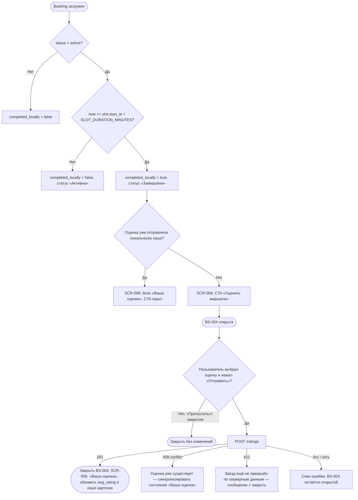

# Оценка маршала

**ID:** LOGIC-005
**Тип:** Логика
**Домен:** 04. Мои брони
**Приоритет:** Medium
**Функциональные блоки:** FB-RATING-001
**Статус:** Черновик

---

## История изменений

| Релиз | ТЗ | Описание изменений |
|-------|-----|-------------------|
| — | — | Первоначальная документация |

---

## Входные данные

| Название | Тип | Возможные значения | Описание |
|----------|-----|---------------------|----------|
| `booking.status` | Кэш (из `Booking`) | `active`, `cancelled`, `late_cancel`, `center_cancelled` | Статус брони |
| `booking.slot.duration_minutes` | Кэш (из `Slot`) | целое число ≥ 1 | Фактическая длительность заезда в минутах (включая инструктаж) |
| `booking.rating` | Кэш (из `Booking`) | `RatingSummary` \| `null` | Оценка маршала для этой брони (если уже оставлена) |

---

## Обзор

Определение состояния «заезд завершён» (`completed`) на клиенте — отсутствует как явный
статус в API — и логика однократной необязательной оценки маршала после завершённого заезда.
Используется на [SCR-005](../screens/SCR-005-my-bookings.md), [SCR-006](../screens/SCR-006-booking-details.md)
через [BS-004](../screens/BS-004-marshal-rating.md).

### User Story

> Как клиент, я хочу оценить маршала после заезда,
> чтобы поделиться впечатлением и помочь центру видеть, кто как работает.

### Бизнес-ценность

- Владелец видит объективную обратную связь по маршалам (из брифа: «есть ребята-звёзды,
  хочу видеть, кто как заходит людям»).
- Средний рейтинг маршала повышает доверие при выборе слота (FR-5).

---

## Точки применения

| Экран/Компонент | Элемент/Триггер | Условие |
|-----------------|------------------|---------|
| [SCR-005 Мои бронирования](../screens/SCR-005-my-bookings.md) | Вычисление бейджа «Завершена» | `booking.status = active AND completed_locally = true` |
| [SCR-006 Детали брони](../screens/SCR-006-booking-details.md) | CTA «Оценить маршала» / блок «Ваша оценка» | `completed_locally = true` |
| [BS-004 Оценка маршала](../screens/BS-004-marshal-rating.md) | Кнопка «Отправить» | Всегда (шторка открыта) |

---

## Флоу

---

## Описание логики

### Шаг 1: Вычисление `completed_locally`

Заезд считается завершённым, если:
`booking.status` == "active" (бронь активна, т.е. клиент присутствовал) и 
текущее время `now` >= `booking.slot.start_at` + `booking.slot.duration_minutes` * 60

Если поле `duration_minutes` отсутствует (старые данные или ошибка API), используется
запасное значение 20 минут с записью предупреждения в лог. Это допустимо для MVP,
но в будущем рекомендуется обеспечить наличие поля в API.

### Шаг 2: Доступность CTA «Оценить маршала»

CTA показывается на SCR-006, если `completed_locally = true` **и** для данной брони ещё нет
сохранённой оценки. Признак «оценка уже есть» — see Шаг 3.

### Шаг 3: Определение «оценка уже отправлена»

API не предоставляет `GET`-эндпоинт для проверки существующей оценки по `booking_id` явно
(нет `GET /ratings`). Отправленная оценка сохраняется локально сразу после успешного
`201` (Шаг 4) и привязывается к `booking_id`, чтобы при повторном открытии SCR-006/BS-004 в
рамках той же установки приложения CTA не показывался повторно. Если пользователь оценил
бронь с другого устройства/после переустановки — единственный источник правды на клиенте
недоступен; при повторной попытке отправки сервер вернёт `409 conflict`, и клиент
переключит UI в состояние «Ваша оценка» (без отображения числового значения, если оно не
возвращается сервером в ошибке).

### Шаг 4: Отправка оценки

`POST /ratings` с `marshal_id`, `booking_id`, `value` (1–5), опционально `comment` (≤ 500
символов). Кнопка «Отправить» на BS-004 disabled, пока `value` не выбран.

### Шаг 5: Обработка результата

`201` — шторка закрывается, SCR-006 переключается в блок «Ваша оценка» (read-only,
редактирование недоступно). Средний рейтинг маршала (`marshal.rating_avg`) в кэше карточек
слотов (SCR-002/SCR-003) обновится при следующей загрузке данных сервером — принудительный
локальный пересчёт не выполняется (сервер — источник истины).

---

## API запросы

### POST /ratings

**Тип:** REST
**Метод:** POST
**Спецификация:** `openapi.yaml` → `createRating`

**Триггер:** Тап «Отправить» на BS-004.

**Параметры/Body:**

| Параметр | Тип | Обязательность | Источник | Описание |
|----------|-----|-----------------|----------|----------|
| `marshal_id` | string(uuid) | Да | `booking.slot.marshal.id` | Оцениваемый маршал |
| `booking_id` | string(uuid) | Да | Контекст перехода SCR-006 | Привязка к завершённому заезду |
| `value` | integer | Да | Шкала звёзд на BS-004 | 1..5 |
| `comment` | string | Нет | Необязательное поле на BS-004 | ≤ 500 символов |

**Обработка ответа:**

| Результат | Условие | UI-реакция |
|-----------|---------|------------|
| Загрузка | — | Лоадер на кнопке «Отправить» |
| Успех (201) | — | Закрыть BS-004 → SCR-006 «Ваша оценка» (read-only) |
| 403 | — | Снек общей ошибки (бронь не принадлежит клиенту либо заезд не завершён по серверным данным) |
| 409 | — | Синхронизировать в состояние «Ваша оценка» без повторной отправки |
| 422 | — | Сообщение «Оценка пока недоступна» + закрыть шторку |
| 5xx / сеть | — | Снек стандартной ошибки, шторка остаётся открытой для повтора |

---

## Связанные требования

### Функциональные (REQ-FUNC-*)

| ID | Название | Приоритет |
|----|----------|-----------|
| REQ-FUNC-RATE-001 | Необязательная однократная оценка маршала после завершённого заезда | Medium |
| REQ-FUNC-RATE-002 | Средний рейтинг маршала отображается в карточках слотов | Medium |

### Интеграции (REQ-INT-*)

| ID | Название | Приоритет |
|----|----------|-----------|
| REQ-INT-RATE-001 | `POST /ratings` (createRating) | Medium |

### Данные (REQ-DATA-*)

| ID | Название | Приоритет |
|----|----------|-----------|
| REQ-DATA-RATE-001 | серверный статус `completed` и длительность слота отсутствуют в контракте — временно вычисляются на клиенте | High |

---

## Критерии приёмки

### Позитивные сценарии

| ID | Критерий | Приоритет |
|----|----------|-----------|
| AC-001 | **Дано** активная бронь, старт которой был более `SLOT_DURATION_MINUTES` назад, **Когда** открыт SCR-006, **Тогда** показан CTA «Оценить маршала» | P1 |
| AC-002 | **Дано** оценка выбрана, **Когда** тап «Отправить», **Тогда** сохраняется оценка, BS-004 закрывается, на SCR-006 виден блок «Ваша оценка» | P1 |

### Негативные сценарии

| ID | Критерий | Приоритет |
|----|----------|-----------|
| AC-N01 | **Дано** оценка уже отправлена ранее, **Когда** повторная попытка (сервер вернул 409), **Тогда** UI показывает «Ваша оценка» без ошибки для пользователя | P2 |

### Граничные условия

| ID | Критерий | Приоритет |
|----|----------|-----------|
| AC-E01 | **Дано** оценка не выбрана, **Когда** попытка тапа «Отправить», **Тогда** кнопка недоступна (disabled) | P1 |
| AC-E02 | **Дано** бронь отменена (`cancelled`/`late_cancel`/`center_cancelled`), **Когда** вычисление `completed_locally`, **Тогда** CTA «Оценить маршала» не показывается | P1 |
