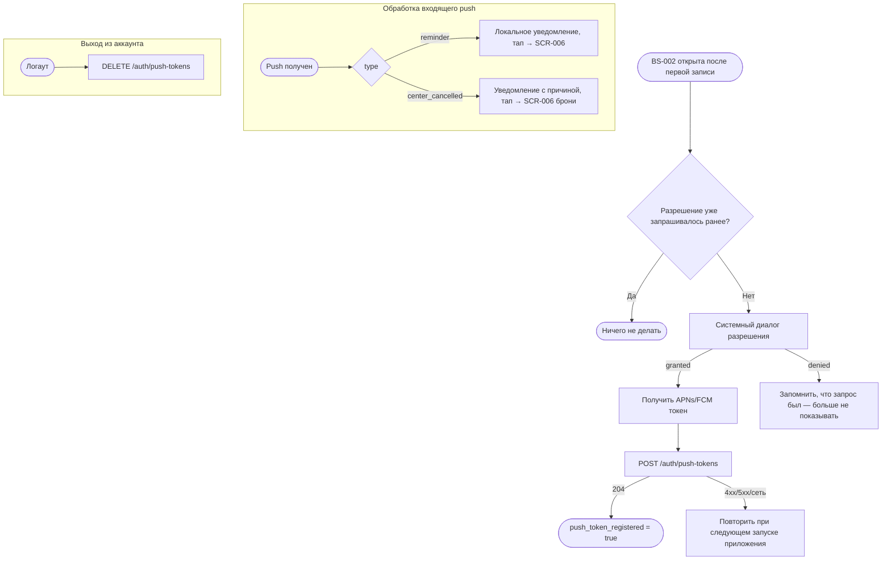

# Push-уведомления

**ID:** LOGIC-006
**Тип:** Логика
**Домен:** 05. Уведомления
**Приоритет:** High
**Функциональные блоки:** FB-PUSH-001, FB-PUSH-002
**Статус:** Черновик

---

## История изменений

| Релиз | ТЗ | Описание изменений |
|-------|-----|-------------------|
| — | — | Первоначальная документация |

---

## Входные данные

| Название | Тип | Возможные значения | Описание |
|----------|-----|---------------------|----------|
| `push_permission_state` | Состояние ОС | `not_determined`, `granted`, `denied` | Системное разрешение на push |
| `push_token_registered` | Локальный кэш | `true`/`false` | Признак, что токен уже отправлен на сервер в текущей сессии |

---

## Обзор

Запрос системного разрешения на push, регистрация/отвязка токена устройства и обработка
двух типов уведомлений: напоминание перед заездом (Should, FR-20) и уведомление об отмене
заезда центром (Must, FR-21, R-008). Разрешение запрашивается **после первой успешной
записи** на [BS-002](../screens/BS-002-booking-success.md) (foundations §8.1) — не на
[SCR-001](../screens/SCR-001-registration.md).

### User Story

> Как клиент, я хочу получить напоминание перед заездом и узнать, если центр отменил заезд,
> чтобы не забыть о записи и не приехать зря.

### Бизнес-ценность

- Снижает число неявок («забывают и не приезжают» — бриф Дениса).
- Единственный канал массового оповещения при отмене по погоде/организационным причинам.

---

## Точки применения

| Экран/Компонент | Элемент/Триггер | Условие |
|-----------------|------------------|---------|
| [BS-002 Подтверждение записи](../screens/BS-002-booking-success.md) | При открытии шторки | Первая успешная запись клиента (единожды за всё время использования аккаунта) |
| [SCR-005 Мои бронирования](../screens/SCR-005-my-bookings.md) | Тап на push об отмене центром | `type = center_cancelled` |
| [SCR-006 Детали брони](../screens/SCR-006-booking-details.md) | Тап на push об отмене центром / напоминание | `type = center_cancelled` \| `type = reminder` |

---

## Флоу

---

## Описание логики

### Шаг 1: Момент запроса разрешения

Системный запрос разрешения на push показывается **один раз за время жизни приложения на
устройстве**, сразу после первого успешного `POST /bookings` (то есть при первом показе
[BS-002](../screens/BS-002-booking-success.md)). Отказ пользователя не блокирует закрытие
шторки и не повторяется автоматически при последующих записях (foundations §8.1). Если
пользователь позже включит уведомления вручную через настройки ОС, приложение должно
зарегистрировать токен при следующем запуске (стандартное поведение ОС-колбэков, без
повторного показа системного диалога).

### Шаг 2: Регистрация токена

При получении `granted` и APNs/FCM токена клиент вызывает `POST /auth/push-tokens` с
токеном и платформой (`ios`/`android`). Повторные регистрации (например, при обновлении
токена ОС) выполняются автоматически без участия пользователя.

### Шаг 3: Обработка входящих push

- **Напоминание перед заездом** (`type = reminder`, Should FR-20): тап открывает
  [SCR-006](../screens/SCR-006-booking-details.md) соответствующей брони.
- **Отмена центром** (`type = center_cancelled`, Must FR-21, R-008): тап открывает
  [SCR-006](../screens/SCR-006-booking-details.md) брони со статусом «Отменён центром» и
  причиной. Если приложение свёрнуто/закрыто — уведомление доставляется системно; при
  открытии приложения из уведомления выполняется deep link на конкретную бронь.

### Шаг 4: Отвязка токена

При выходе из аккаунта ([LOGIC-001](LOGIC-001-auth-otp.md), шаг 4) клиент вызывает
`DELETE /auth/push-tokens` с текущим токеном и платформой, чтобы прекратить получение
уведомлений, адресованных вышедшему клиенту.

---

## API запросы

### POST /auth/push-tokens

**Тип:** REST
**Метод:** POST
**Спецификация:** `openapi.yaml` → `registerPushToken`

**Триггер:** Получение push-токена после `granted` (Шаг 2) или обновление токена ОС.

**Параметры/Body:**

| Параметр | Тип | Обязательность | Источник | Описание |
|----------|-----|-----------------|----------|----------|
| `token` | string | Да | SDK платформы (APNs/FCM) | Push-токен устройства |
| `platform` | string | Да | Определяется сборкой | `ios` \| `android` |

**Обработка ответа:**

| Результат | Условие | UI-реакция |
|-----------|---------|------------|
| Успех (204) | — | `push_token_registered = true`, без видимого UI |
| 4xx/5xx/сеть | — | Без блокирующего UI; повторная попытка при следующем запуске приложения |

### DELETE /auth/push-tokens

**Тип:** REST
**Метод:** DELETE
**Спецификация:** `openapi.yaml` → `deletePushToken`

**Триггер:** Выход из аккаунта.

**Параметры/Body:**

| Параметр | Тип | Обязательность | Источник | Описание |
|----------|-----|-----------------|----------|----------|
| `token` | string | Да | Локально сохранённый токен | Push-токен устройства |
| `platform` | string | Да | Определяется сборкой | `ios` \| `android` |

**Обработка ответа:**

| Результат | Условие | UI-реакция |
|-----------|---------|------------|
| Успех (204) / 404 | — | Продолжить логаут независимо от результата |
| 5xx/сеть | — | Продолжить логаут независимо от результата (best-effort) |

---

## Связанные требования

### Функциональные (REQ-FUNC-*)

| ID | Название | Приоритет |
|----|----------|-----------|
| REQ-FUNC-PUSH-001 | Запрос разрешения на push после первой успешной записи | Should (High) |
| REQ-FUNC-PUSH-002 | Напоминание перед заездом | Should |
| REQ-FUNC-PUSH-003 | Уведомление об отмене заезда центром | Must (Critical) |

### Интеграции (REQ-INT-*)

| ID | Название | Приоритет |
|----|----------|-----------|
| REQ-INT-PUSH-001 | `POST /auth/push-tokens`, `DELETE /auth/push-tokens` | High |

---

## Критерии приёмки

| ID | Критерий |
|----|----------|
| AC-001 | **Дано** первая успешная запись клиента, **Когда** открыта BS-002, **Тогда** показан системный запрос разрешения на push |
| AC-002 | **Дано** вторая и последующие успешные записи, **Когда** открыта BS-002, **Тогда** системный запрос повторно не показывается |
| AC-003 | **Дано** разрешение получено, **Когда** доступен push-токен, **Тогда** он зарегистрирован через API без участия пользователя |
| AC-004 | **Дано** пришёл push `center_cancelled`, **Когда** тап по уведомлению, **Тогда** открываются детали соответствующей брони на SCR-006 |
| AC-005 | **Дано** выход из аккаунта, **Когда** это происходит, **Тогда** push-токен отвязывается от сервера |
