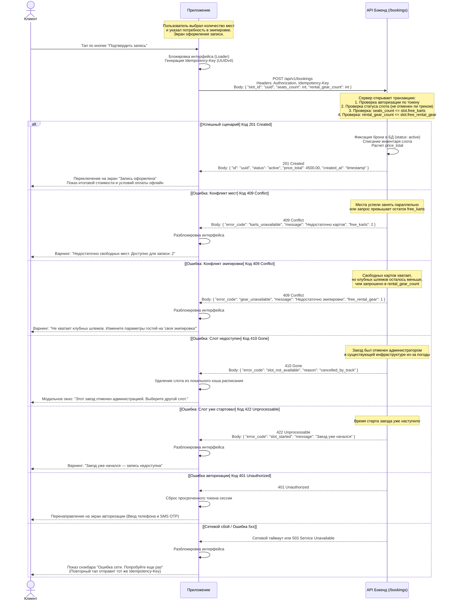

# Sequence-диаграмма сценария создания брони (createBooking)

> Описание логики взаимодействия между Мобильным приложением и API Бэкенда при оформлении группового или одиночного бронирования (Use Case: UC-3).

## Сквозные технические правила

1. Авторизация: Каждый запрос должен содержать валидный токен в заголовке Authorization: Bearer <token>. Возврат кода 401 приводит к сбросу сессии в приложении.
2. Защита от дубликатов (Идемпотентность): Для предотвращения повторного списания мест из-за сбоев сети мобильное приложение обязано генерировать UUIDv4 и передавать его в заголовке Idempotency-Key.
3. Атомарность транзакции: Проверка остатка картов и свободной экипировки выполняется сервером внутри единой изолированной транзакции базы данных во избежание овербукинга.
4. Расчет стоимости: Конечная стоимость рассчитывается на стороне сервера. Оплата происходит исключительно в офлайн-формате при визите в картинг-центр (наличные или перевод).

## Диаграмма последовательности

## Спецификация ответов API для обработки на клиенте

| HTTP Статус | Код бизнес-ошибки | Описание сценария | Ожидаемая реакция UI-слоя приложения |
| :-- | :-- | :-- | :-- |
| 201 Created | — | Запись успешно создана на бэкенде. Ресурсы заблокированы под пользователя. | Перевод пользователя на экран успеха (Success State). Вывод итоговой стоимости price_total. |
| 409 Conflict | karts_unavailable | Количество запрашиваемых картов превысило доступный остаток на момент фиксации транзакции. | Обновить счетчик мест на экране, подсветить поле ввода красным цветом, показать ограничение. |
| 409 Conflict | gear_unavailable | Недостаточно единиц клубной экипировки (шлемов) на складе для данного времени. | Выдать подсказку: "Предложите части участников взять свой шлем, чтобы пройти регистрацию". |
| 410 Gone | slot_not_available | Клиент пытался записаться на слот, который администратор только что перевел в статус cancelled. | Показать системное уведомление, принудительно вернуть пользователя назад на экран расписания (календарь). |
| 422 Unprocessable | slot_started | Время старта заезда уже наступило. Запись невозможна. | Показать уведомление: "Заезд уже начался". Кнопка записи блокируется на экране деталей. |
| 401 Unauthorized | — | Токен сессии истек или недействителен. | Очистить локальное хранилище токенов, перенаправить на экран входа (SCR-001). |
| 5xx / Timeout | — | Внутренняя ошибка сервера или сбой сети. | Показать снэкбар с ошибкой. Повторный запрос использует тот же Idempotency-Key для защиты от дублей. |