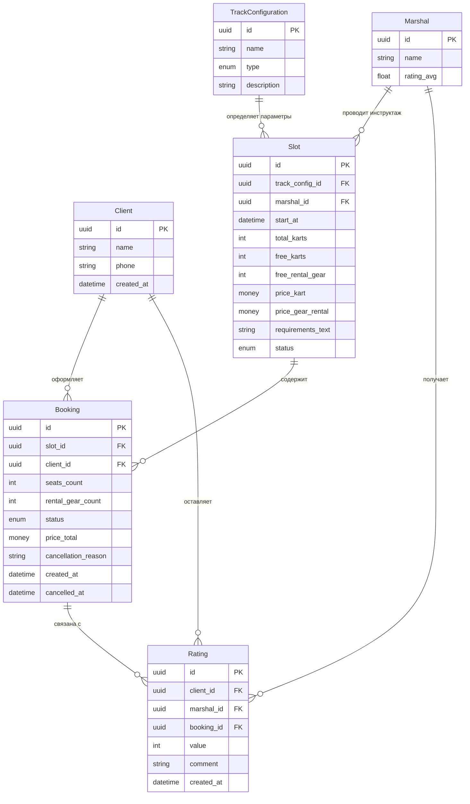
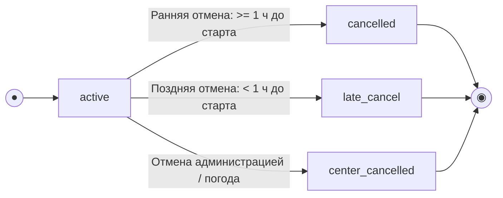

# Модель данных (Информационная модель API)

> Проектирование ресурсной модели клиентского API картинг-центра «Апекс».
> Данные о расписании заездов, конфигурациях трасс и маршалах-инструкторах поступают из существующей инфраструктуры трека и доступны клиентскому приложению исключительно для чтения (Read-Only).
> Клиентское приложение напрямую управляет (создает, изменяет) только сущностями Клиента (Client), Бронирования (Booking) и Оценки маршала (Rating).

## Сущности и атрибуты

### Client (Клиент) — [Изменяемая / Управляемая приложением]

| Атрибут | Тип | Режим | Описание |
| :-- | :-- | :-- | :-- |
| `id` | UUID (PK) | Read-only | Уникальный идентификатор клиента в системе |
| `name` | string | Write / Read | Имя (или никнейм) гостя, отображаемое в профиле |
| `phone` | string (unique) | Write / Read | Номер телефона (основной идентификатор / логин). Подтверждается через SMS OTP |
| `created_at` | datetime | Read-only | Дата и время регистрации пользователя |

### TrackConfiguration (Конфигурация трассы) — [Справочник, Read-Only для приложения]

| Атрибут | Тип | Режим | Описание |
| :-- | :-- | :-- | :-- |
| `id` | UUID (PK) | Read-only | Уникальный идентификатор конфигурации трассы |
| `name` | string | Read-only | Наименование конфигурации (например, "Короткая" или "Длинная") |
| `type` | enum (novice / experienced) | Read-only | Тип трассы, задающий жесткий лимит группы: novice — короткая (до 8 человек), experienced — длинная (до 14 человек) |
| `description` | string? | Read-only | Дополнительное текстовое описание особенностей покрытия или поворотов |

### Marshal (Маршал-инструктор) — [Справочник, Read-Only для приложения]

| Атрибут | Тип | Режим | Описание |
| :-- | :-- | :-- | :-- |
| `id` | UUID (PK) | Read-only | Уникальный идентификатор маршала |
| `name` | string | Read-only | Имя маршала-инструктора, ведущего заезд и инструктаж |
| `rating_avg` | float | Read-only | Средний рейтинг маршала на основе исторических однократных оценок клиентов |

### Slot (Слот расписания / Заезд) — [Предзаполняется бэком, Read-Only для приложения]

| Атрибут | Тип | Режим | Описание |
| :-- | :-- | :-- | :-- |
| `id` | UUID (PK) | Read-only | Уникальный идентификатор слота заезда |
| `track_config_id` | FK → TrackConfiguration | Read-only | Ссылка на используемую конфигурацию трассы |
| `marshal_id` | FK → Marshal | Read-only | Ссылка на назначенного маршала-инструктора |
| `start_at` | datetime (UTC) | Read-only | Время старта заезда в UTC. Является источником истины для расчета правила "1 часа до отмены" |
| `total_karts` | int | Read-only | Исходное число картов, выделенных под заезд (макс. 14, для novice ограничивается 8) |
| `free_karts` | int | Read-only | Текущее расчетное количество свободных картов (мест) в заезде |
| `free_rental_gear` | int | Read-only | Количество свободных комплектов клубной экипировки (шлем + подшлемник) |
| `price_kart` | money (RUB) | Read-only | Стоимость проката карта за 1 заезд (включает инструктаж) |
| `price_gear_rental` | money (RUB) | Read-only | Фиксированный тариф за аренду одного комплекта экипировки |
| `requirements_text` | string | Read-only | Возрастные и ростовые ограничения (например, "От 140 см, возраст от 12 лет") для вывода предупреждений в UI |
| `status` | enum (scheduled / cancelled) | Read-only | Статус самого заезда на стороне трека (запланирован или полностью отменен центром) |

### Booking (Бронь / Запись на заезд) — [Изменяемая / Управляемая приложением]

| Атрибут | Тип | Режим | Описание |
| :-- | :-- | :-- | :-- |
| `id` | UUID (PK) | Read-only | Идентификатор бронирования |
| `slot_id` | FK → Slot | Write-once | Ссылка на выбранный слот расписания |
| `client_id` | FK → Client | Write-once | Ссылка на клиента, оформившего бронирование |
| `seats_count` | int | Write-once | Количество забронированных мест (включая клиента и его гостей, от 1 до лимита группы) |
| `rental_gear_count` | int | Write-once | Количество комплектов экипировки, берущихся в прокат (диапазон от 0 до seats_count) |
| `status` | enum (active, cancelled, late_cancel, center_cancelled) | Write / Read | Текущий статус бронирования (см. жизненный цикл) |
| `price_total` | money (RUB) | Read-only | Итоговая стоимость брони. Рассчитывается бэкендом атомарно: (price_kart * seats_count) + (price_gear_rental * rental_gear_count) |
| `cancellation_reason` | string? | Read-only | Заполняется сервером, если заезд был отменен центром (center_cancelled) из-за погоды или тех. причин |
| `created_at` | datetime | Read-only | Дата и время создания бронирования |
| `cancelled_at` | datetime? | Read-only | Дата и время отмены бронирования (если была отмена) |

### Rating (Оценка маршала) — [Изменяемая / Управляемая приложением]

| Атрибут | Тип | Режим | Описание |
| :-- | :-- | :-- | :-- |
| `id` | UUID (PK) | Read-only | Уникальный идентификатор оценки |
| `client_id` | FK → Client | Write-once | Клиент, оставивший оценку |
| `marshal_id` | FK → Marshal | Write-once | Оцениваемый маршал |
| `booking_id` | FK → Booking | Write-once | Бронь, по которой оставлена оценка |
| `value` | int (1–5) | Write-once | Числовая оценка (звёзды) |
| `comment` | string? | Write-once | Опциональный текстовый комментарий |
| `created_at` | datetime | Read-only | Дата и время создания оценки |

---

## Диаграмма связей сущностей (ERD)

## Жизненный цикл бронирования (Диаграмма состояний)

### Бизнес-логика изменения состояний и влияние на ресурсы слота

| Из | Событие / условие | В | Эффект на слот |
| :-- | :-- | :-- | :-- |
| — | Клиент подтверждает бронь | active | free_karts -= seats_count; free_rental_gear -= rental_gear_count |
| active | Отмена, до старта >= 1 ч | cancelled | Карты и экипировка возвращаются в слот |
| active | Отмена, до старта < 1 ч | late_cancel | Карты и экипировка НЕ освобождаются; штрафов нет |
| active | Слот отменён центром | center_cancelled | Слот снят; клиент уведомляется (push) |
| cancelled / late_cancel / center_cancelled | — (терминальные) | — | Повторная отмена не выполняется |

---

## Ключевые инварианты целостности данных

1. Расчет остатка свободных мест: Slot.free_karts всегда вычисляется как: Slot.total_karts - Σ(Booking.seats_count) по всем бронированиям данного слота со статусами active и late_cancel.

2. Жесткий потолок конфигурации: Slot.total_karts не может превышать 8 для заездов типа novice (короткая трасса) и 14 для experienced (длинная трасса).

3. Расчет остатка экипировки: Slot.free_rental_gear всегда вычисляется как: исходный прокатный фонд - Σ(Booking.rental_gear_count) по всем бронированиям со статусами active и late_cancel.

4. Оценка маршала: Оценка (Rating) может быть создана только в том случае, если:
    - Текущее время превышает Slot.start_at + длительность заезда
    - Статус брони равен active (заезд состоялся)
    - Оценка для этой брони ещё не была оставлена (однократность)

5. Только ранняя отмена возвращает места и экипировку в слот (cancelled); late_cancel удерживает и место, и экипировку.

6. Запись/отмена выполняются атомарно: овербукинг и двойная бронь исключены при параллельных операциях.