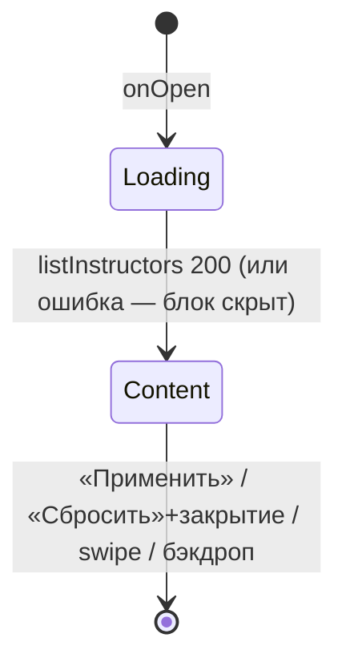

# Фильтры

**ID:** BS-001
**Тип:** Bottom Sheet
**Домен:** 02. Заезды
**Приоритет:** High
**Статус:** Черновик
**Функциональные блоки:** FB-SLOTS-003
**Зона авторизации:** АЗ
**Дизайн-макет:** [Figma] — версия 0.1

---

## Содержание

- [История изменений](#история-изменений)
- [Обзор](#обзор)
- [Навигация](#навигация)
- [Входные данные](#входные-данные)
- [Свойства Bottom Sheet](#свойства-bottom-sheet)
- [Инициализация](#инициализация)
- [Используемые запросы](#используемые-запросы)
- [Макет экрана](#макет-экрана)
- [Элементы экрана](#элементы-экрана)
- [Состояния экрана](#состояния-экрана)
- [Действия пользователя](#действия-пользователя)
- [Связанные требования](#связанные-требования)
- [Критерии приёмки](#критерии-приёмки)

---

## История изменений

| Релиз | ТЗ | Описание изменений |
|-------|-----|-------------------|
| — | — | Первоначальная документация |

---

## Обзор

Шторка уточнения списка [SCR-002](SCR-002-slot-list.md) по дате, конфигурации трассы,
наличию мест и маршалу.

### User Story

> Как клиент, я хочу отфильтровать заезды по дате, трассе и маршалу,
> чтобы быстрее найти подходящий вариант.

### Бизнес-ценность

- Сокращает путь к записи при большом числе слотов в высокий сезон.

---

## Навигация

### Входящая (откуда открывается)

| Источник | Триггер | Условие | Передаваемые параметры |
|----------|---------|---------|--------------------------|
| [SCR-002 Список слотов](SCR-002-slot-list.md) | Тап «Фильтры» | Всегда | Текущие значения `filters` |

### Исходящая (куда ведёт)

| Назначение | Триггер | Передаваемые параметры |
|------------|---------|--------------------------|
| [SCR-002 Список слотов](SCR-002-slot-list.md) | «Применить» | Обновлённый `filters` |
| [SCR-002 Список слотов](SCR-002-slot-list.md) | Закрытие без применения / бэкдроп | Исходный `filters` (без изменений) |

---

## Входные данные

| Название | Тип | Возможные значения | Описание |
|----------|-----|---------------------|----------|
| `filters` (текущие) | Состояние, переданное с SCR-002 | см. схему ниже | Черновик редактируется локально до «Применить» |
| `instructors` | Кэш / запрос при открытии | список `Marshal` | Справочник для чипов маршалов |

---

## Свойства Bottom Sheet

| Свойство | Значение |
|----------|----------|
| Высота | Динамическая, по контенту |
| Закрытие свайпом | Да |
| Закрытие по тапу вне области | Да |
| Затемнение фона | Да |
| Кнопка закрытия | Нет (только грабер + свайп/бэкдроп) |

---

## Инициализация

### Диаграмма загрузки


### Запросы при открытии

| № | Запрос | Критичный | Зависит от | Условие |
|---|--------|-----------|------------|---------|
| 1 | [listInstructors](#listinstructors) | Нет | — | Всегда (для чипов маршалов); при ошибке — выбор маршала скрывается, остальные фильтры работают |

---

## Используемые запросы

### listInstructors

**Тип:** REST
**Метод:** GET
**Спецификация:** `openapi.yaml` → `listInstructors` (`/instructors`)

**Триггер:** Открытие шторки.

**Параметры:**

| Параметр | Тип | Обязательность | Источник | Описание |
|----------|-----|-----------------|----------|----------|
| `limit` | integer | Нет | Константа приложения (напр. 100) | Справочник обычно небольшой |
| `offset` | integer | Нет | 0 | — |

**Обработка ответа:**

| Результат | Условие | UI-реакция |
|-----------|---------|-------------|
| Загрузка | — | Скелетон блока «Маршал» |
| Успех | `items` не пуст | Список чипов маршалов |
| Успех | `items` пуст | Блок «Маршал» скрывается |
| HTTP 4xx/5xx | — | Блок «Маршал» скрывается (не блокирует остальные фильтры) |
| Сеть | Нет соединения | Блок «Маршал» скрывается |

---

## Макет экрана

### Структура

```
┌──────────────────────────────────────┐
│  ▭  Фильтры              Сбросить    │
│  Дата: [Сегодня][Неделя][Диапазон]   │
│  Трасса: [Короткая] [Длинная]        │
│  [ ] Только со свободными местами    │
│  Маршал: [список / чипы]             │
│  [        Применить        ]         │
└──────────────────────────────────────┘
```

### Компоненты

| Компонент | Описание | Обязательность |
|-----------|----------|------------------|
| Пресеты даты | «Сегодня» / «Неделя» / «Диапазон» | Да |
| Мультивыбор трассы | Короткая/Длинная | Да |
| Переключатель «Только со свободными местами» | On/Off | Да |
| Чипы маршалов | Мультивыбор из `listInstructors` | Да (при наличии данных) |
| «Сбросить» | Возврат к значениям по умолчанию | Да |
| «Применить» | Primary CTA | Да |

---

## Элементы экрана

### 1. Параметры фильтра

| Элемент | Описание | Источник данных | Валидация | Действие |
|---------|----------|--------------------|-----------|----------|
| Дата/период | Пресеты «Сегодня»/«Неделя» или диапазон «с/по» | Черновик `filters.date_from/date_to` | Диапазон «по» не раньше «с» | Обновление черновика |
| Конфигурация трассы | Мультивыбор чипов | Черновик `filters.track_config` | — | Обновление черновика |
| Только со свободными местами | Toggle | Черновик `filters.only_available` | — | Обновление черновика |
| Маршал | Мультивыбор чипов | `listInstructors.items`, черновик `filters.instructor_id` | — | Обновление черновика |
| «Сбросить» | Текстовая кнопка в хедере | — | — | Черновик = значения по умолчанию (дата: 7 дней, трасса: любая, места: выкл, маршал: любой) |
| «Применить» | Primary CTA | — | — | Передать черновик в SCR-002 → `listSlots` с новыми параметрами → закрыть шторку |

**Условия доступности:**
- «Применить» активна всегда (даже без изменений — эквивалент закрытию).
- Диапазон дат «по» не может быть раньше «с» — при некорректном выборе «по» автоматически
  подтягивается к «с».

---

## Состояния экрана

### Таблица состояний

| Состояние | Условие | Отображение |
|-----------|---------|----------------|
| Loading | Ожидание `listInstructors` | Скелетон блока «Маршал», остальные поля доступны сразу |
| Content | Форма с черновиком фильтров | Стандартный вид |
| Error (частичный) | `listInstructors` вернул 4xx/5xx/сеть | Блок «Маршал» скрыт, ошибка не блокирует остальные фильтры |

Empty для самой шторки не применим (форма всегда рендерится).

### Диаграмма переходов



---

## Действия пользователя

| Действие | Элемент | Триггер | Результат |
|----------|---------|---------|-----------|
| Выбрать пресет даты | Чипы даты | Tap | Обновление черновика |
| Задать диапазон | Поля «с»/«по» | Tap → date picker | Обновление черновика |
| Выбрать трассу | Чипы «Короткая»/«Длинная» | Tap | Обновление черновика (мультивыбор) |
| Включить фильтр мест | Toggle | Tap | Обновление черновика |
| Выбрать маршала | Чипы маршалов | Tap | Обновление черновика (мультивыбор) |
| Сбросить | «Сбросить» | Tap | Черновик = значения по умолчанию |
| Применить | «Применить» | Tap | SCR-002 обновляется, шторка закрывается |
| Закрыть без изменений | Swipe / бэкдроп | Swipe down / Tap вне шторки | SCR-002 без изменений |

---

## Связанные требования

### Функциональные (REQ-FUNC-*)

| ID | Название | Приоритет |
|----|----------|-----------|
| REQ-FUNC-SLOTS-003 | Фильтрация по дате, трассе, наличию мест, маршалу | High |

### Интеграции (REQ-INT-*)

| ID | Название | Приоритет |
|----|----------|-----------|
| REQ-INT-SLOTS-002 | `GET /instructors` (listInstructors) | Medium |

---

## Критерии приёмки

### Позитивные сценарии

| ID | Критерий | Приоритет |
|----|----------|-----------|
| AC-001 | **Дано** выбраны фильтры, **Когда** тап «Применить», **Тогда** SCR-002 обновляется согласно фильтрам, шторка закрывается | P1 |
| AC-002 | **Дано** изменены фильтры, **Когда** тап «Сбросить», **Тогда** черновик возвращается к значениям по умолчанию | P1 |

### Негативные сценарии

| ID | Критерий | Приоритет |
|----|----------|-----------|
| AC-N01 | **Дано** ошибка загрузки маршалов, **Когда** открытие шторки, **Тогда** блок «Маршал» скрыт, остальные фильтры работают | P2 |

### Граничные условия

| ID | Критерий | Приоритет |
|----|----------|-----------|
| AC-E01 | **Дано** изменены фильтры без нажатия «Применить», **Когда** закрытие свайпом/бэкдропом, **Тогда** изменения не сохраняются | P1 |
