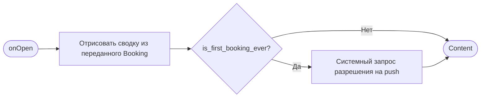
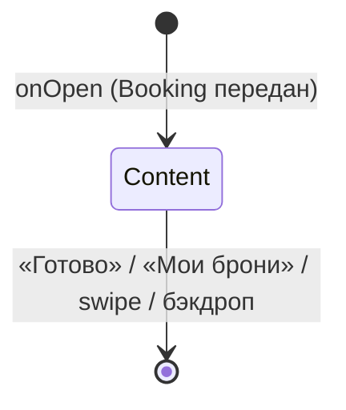

# Подтверждение записи

**ID:** BS-002
**Тип:** Bottom Sheet
**Домен:** 03. Запись
**Приоритет:** High
**Статус:** Черновик
**Функциональные блоки:** FB-BOOKING-004, FB-PUSH-001
**Зона авторизации:** АЗ
**Дизайн-макет:** [Figma] — версия 0.1

---

## Содержание

- [История изменений](#история-изменений)
- [Обзор](#обзор)
- [Навигация](#навигация)
- [Входные данные](#входные-данные)
- [Применяемые логики](#применяемые-логики)
- [Свойства Bottom Sheet](#свойства-bottom-sheet)
- [Инициализация](#инициализация)
- [Макет экрана](#макет-экрана)
- [Элементы экрана](#элементы-экрана)
- [Состояния экрана](#состояния-экрана)
- [Действия пользователя](#действия-пользователя)
- [Связанные требования](#связанные-требования)
- [Критерии приёмки](#критерии-приёмки)

---

## История изменений

| Релиз | ТЗ | Описание изменений |
|-------|-----|-------------------|
| — | — | Первоначальная документация |

---

## Обзор

Успешное завершение записи: сводка брони, напоминание об офлайн-оплате, следующий шаг.
Открывается только после успешного `201` от `createBooking` на SCR-004.

### User Story

> Как клиент, я хочу сразу увидеть подтверждение и детали своей записи,
> чтобы убедиться, что всё оформлено верно.

### Бизнес-ценность

- Явное подтверждение снижает тревожность и повторные обращения «а точно записался?».
- Точка включения push-уведомлений — снижает число неявок в дальнейшем.

---

## Навигация

### Входящая (откуда открывается)

| Источник | Триггер | Условие | Передаваемые параметры |
|----------|---------|---------|--------------------------|
| [SCR-004 Оформление записи](SCR-004-booking.md) | Успешный `createBooking` (201) | Всегда | `Booking` (полный объект ответа) |

### Исходящая (куда ведёт)

| Назначение | Триггер | Передаваемые параметры |
|------------|---------|--------------------------|
| [SCR-005 Мои бронирования](SCR-005-my-bookings.md) | «Мои брони» | — |
| [SCR-002 Список слотов](SCR-002-slot-list.md) | «Готово» | — (стек записи закрывается целиком) |

---

## Входные данные

| Название | Тип | Возможные значения | Описание |
|----------|-----|---------------------|----------|
| `booking` | Параметр перехода | `Booking` | Результат успешной записи |
| `is_first_booking_ever` | Локальный кэш (флаг устройства/аккаунта) | `true`/`false` | Определяет показ системного запроса push |

---

## Применяемые логики

| Логика | Элемент/Триггер | Описание |
|--------|------------------|----------|
| [LOGIC-006 Push-уведомления](../09-logic/LOGIC-006-push-notifications.md) | При открытии шторки | Запрос системного разрешения на push после первой записи |

---

## Свойства Bottom Sheet

| Свойство | Значение |
|----------|----------|
| Высота | По контенту |
| Закрытие свайпом | Да |
| Закрытие по тапу вне области | Да |
| Затемнение фона | Да |
| Кнопка закрытия | Нет (закрытие через «Готово»/«Мои брони»/свайп/бэкдроп) |

---

## Инициализация

### Диаграмма загрузки



Запросов к API при открытии нет — все данные уже получены на SCR-004 (ответ `createBooking`).

---

## Макет экрана

### Структура

```
┌──────────────────────────────────────┐
│  ▭   ✓  Вы записаны                   │
│  5 июля, 14:00 · Короткая             │
│  Маршал: Иван · 2 места               │
│  1 прокат · Итого 5200 ₽              │
│  Оплата на месте: наличные…           │
│  [   Мои брони   ]  [  Готово  ]      │
└──────────────────────────────────────┘
```

### Компоненты

| Компонент | Описание | Обязательность |
|-----------|----------|------------------|
| Иконка успеха | ✓ | Да |
| Сводка брони | Дата, трасса, маршал, места, экипировка, сумма | Да |
| Текст об оплате | Статический | Да |
| Кнопка «Мои брони» | Secondary | Да |
| Кнопка «Готово» | Primary | Да |

---

## Элементы экрана

### 1. Сводка

| Элемент | Описание | Источник данных | Валидация | Действие |
|---------|----------|--------------------|-----------|----------|
| Заголовок «Вы записаны» | Текст | Статический | — | — |
| Дата/время | — | `booking.slot.start_at` | — | — |
| Конфигурация трассы | — | `booking.slot.track_config.name` | — | — |
| Маршал | — | `booking.slot.marshal.name` | — | — |
| Число мест | — | `booking.seats_count` | — | — |
| Экипировка | «N прокат / M своя» | `booking.rental_gear_count`, `booking.seats_count − booking.rental_gear_count` | — | — |
| Итого | — | `booking.price_total` | — | — |
| Текст об оплате | «Оплата на месте: наличные или перевод на карту» | Foundations §6 | — | — |
| «Мои брони» | Secondary CTA | — | — | Переход на [SCR-005](SCR-005-my-bookings.md) |
| «Готово» | Primary CTA | — | — | Закрыть шторку → [SCR-002](SCR-002-slot-list.md), стек записи (SCR-003/SCR-004) закрывается целиком |

---

## Состояния экрана

### Таблица состояний

| Состояние | Условие | Отображение |
|-----------|---------|----------------|
| Content | Всегда (данные уже есть) | Сводка брони |

Loading/Empty/Error не применимы — шторка открывается только после успешного ответа сервера,
без собственных запросов.

### Диаграмма переходов



---

## Действия пользователя

| Действие | Элемент | Триггер | Результат |
|----------|---------|---------|-----------|
| Перейти в брони | «Мои брони» | Tap | Переход на [SCR-005](SCR-005-my-bookings.md), шторка закрыта |
| Завершить | «Готово» | Tap | Переход на [SCR-002](SCR-002-slot-list.md), весь стек записи закрыт |
| Закрыть без выбора | Swipe / бэкдроп | Swipe down / Tap вне шторки | Эквивалентно «Готово» |
| Ответить на системный запрос push | Системный диалог | Разрешить/Отклонить | См. [LOGIC-006](../09-logic/LOGIC-006-push-notifications.md); не блокирует остальные действия |

---

## Связанные требования

### Функциональные (REQ-FUNC-*)

| ID | Название | Приоритет |
|----|----------|-----------|
| REQ-FUNC-BOOK-004 | Подтверждение записи со сводкой | High |
| REQ-FUNC-PUSH-001 | Запрос разрешения на push после первой успешной записи | Should (High) |

---

## Критерии приёмки

### Позитивные сценарии

| ID | Критерий | Приоритет |
|----|----------|-----------|
| AC-001 | **Дано** успешная запись, **Когда** открыта шторка, **Тогда** отображена корректная сводка брони | P0 |
| AC-002 | **Дано** это первая успешная запись клиента, **Когда** открыта шторка, **Тогда** показан системный запрос разрешения на push | P1 |

### Негативные сценарии

| ID | Критерий | Приоритет |
|----|----------|-----------|
| AC-N01 | **Дано** пользователь отклонил push-разрешение, **Когда** это происходит, **Тогда** шторка закрывается штатно по «Готово»/«Мои брони» | P2 |

### Граничные условия

| ID | Критерий | Приоритет |
|----|----------|-----------|
| AC-E01 | **Дано** это не первая запись клиента, **Когда** открыта шторка, **Тогда** системный запрос push не показывается повторно | P1 |
