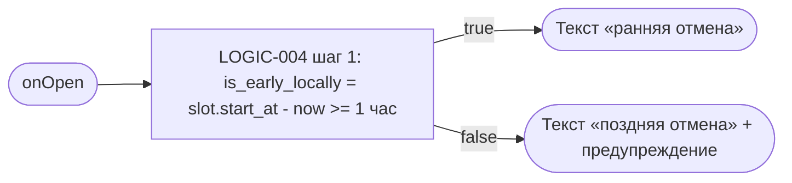
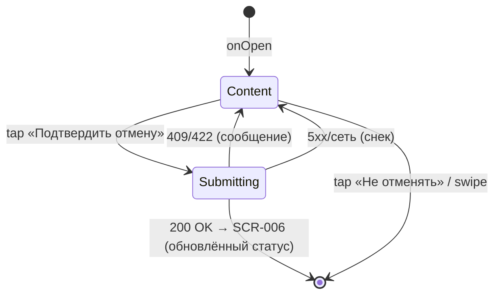

# Подтверждение отмены

**ID:** BS-003
**Тип:** Bottom Sheet
**Домен:** 04. Мои брони
**Приоритет:** High
**Статус:** Черновик
**Функциональные блоки:** FB-BOOKING-007
**Зона авторизации:** АЗ
**Дизайн-макет:** [Figma] — версия 0.1

---

## Содержание

- [История изменений](#история-изменений)
- [Обзор](#обзор)
- [Навигация](#навигация)
- [Входные данные](#входные-данные)
- [Применяемые логики](#применяемые-логики)
- [Свойства Bottom Sheet](#свойства-bottom-sheet)
- [Инициализация](#инициализация)
- [Используемые запросы](#используемые-запросы)
- [Макет экрана](#макет-экрана)
- [Элементы экрана](#элементы-экрана)
- [Состояния экрана](#состояния-экрана)
- [Действия пользователя](#действия-пользователя)
- [Связанные требования](#связанные-требования)
- [Критерии приёмки](#критерии-приёмки)

---

## История изменений

| Релиз | ТЗ | Описание изменений |
|-------|-----|-------------------|
| — | — | Первоначальная документация |

---

## Обзор

Подтверждение деструктивного действия — отмены брони. Объясняет последствия по правилу
1 часа до старта. Штрафов нет.

### User Story

> Как клиент, я хочу заранее понимать последствия отмены (особенно поздней),
> прежде чем подтвердить её, чтобы не удивиться результату.

### Бизнес-ценность

- Прозрачность правил снижает недовольство и обращения в поддержку.
- Явное подтверждение защищает от случайной отмены брони.

---

## Навигация

### Входящая (откуда открывается)

| Источник | Триггер | Условие | Передаваемые параметры |
|----------|---------|---------|--------------------------|
| [SCR-006 Детали брони](SCR-006-booking-details.md) | «Отменить» | `booking.status = active` | `booking_id`, `slot.start_at` |

### Исходящая (куда ведёт)

| Назначение | Триггер | Передаваемые параметры |
|------------|---------|--------------------------|
| [SCR-006 Детали брони](SCR-006-booking-details.md) | «Подтвердить отмену» (успех) | Обновлённый статус брони |
| [SCR-006 Детали брони](SCR-006-booking-details.md) | «Не отменять» | — (без изменений) |

---

## Входные данные

| Название | Тип | Возможные значения | Описание |
|----------|-----|---------------------|----------|
| `booking_id` | Параметр перехода | UUID | Бронь для отмены |
| `slot.start_at` | Параметр перехода | date-time | Для локального предупреждения о поздней отмене |

---

## Применяемые логики

| Логика | Элемент/Триггер | Описание |
|--------|------------------|----------|
| [LOGIC-004 Отмена брони](../09-logic/LOGIC-004-cancel-booking.md) | «Подтвердить отмену» | Локальное предупреждение + `POST /bookings/{id}/cancel` |

---

## Свойства Bottom Sheet

| Свойство | Значение |
|----------|----------|
| Высота | По контенту |
| Закрытие свайпом | Да |
| Закрытие по тапу вне области | **Нет** (критичное подтверждение — только явная кнопка, foundations §4.3) |
| Затемнение фона | Да |
| Кнопка закрытия | Нет (закрытие через «Не отменять» / успешное подтверждение) |

---

## Инициализация

### Диаграмма загрузки



Запросов к API при открытии нет — используется переданное с SCR-006 время старта слота.

---

## Используемые запросы

### cancelBooking

**Тип:** REST
**Метод:** POST
**Спецификация:** `openapi.yaml` → `cancelBooking` (`/bookings/{bookingId}/cancel`)

**Триггер:** Тап «Подтвердить отмену».

Полное описание параметров и обработки ответов — см.
[LOGIC-004 §API запросы](../09-logic/LOGIC-004-cancel-booking.md#api-запросы).

---

## Макет экрана

### Структура

```
┌──────────────────────────────────────┐
│  ▭   Отменить запись?                 │
│  [текст правила 1 часа]               │
│  ⚠ Поздняя отмена: … (если < 1 ч)     │
│  Штраф не взимается.                  │
│  [  Подтвердить отмену  ]             │
│  [      Не отменять      ]            │
└──────────────────────────────────────┘
```

### Компоненты

| Компонент | Описание | Обязательность |
|-----------|----------|------------------|
| Заголовок «Отменить запись?» | — | Да |
| Текст общего правила отмены | Foundations §6 | Да |
| Блок «Поздняя отмена» | Условно, если < 1 ч | Условно |
| Текст «Штраф не взимается» | При поздней отмене | Условно |
| «Подтвердить отмену» | Destructive CTA | Да |
| «Не отменять» | Safe CTA | Да |

---

## Элементы экрана

### 1. Контент подтверждения

| Элемент | Описание | Источник данных | Валидация | Действие |
|---------|----------|--------------------|-----------|----------|
| Заголовок | «Отменить запись?» | Статический | — | — |
| Общее правило | Текст foundations §6 | Статический | — | — |
| Текущий случай | «Ранняя» / «Поздняя» | Вычисляется по [LOGIC-004](../09-logic/LOGIC-004-cancel-booking.md) шаг 1 | — | — |
| «Штраф не взимается» | При поздней отмене | Статический | — | — |
| «Подтвердить отмену» | Destructive CTA | — | — | [LOGIC-004](../09-logic/LOGIC-004-cancel-booking.md) → `POST /bookings/{id}/cancel` |
| «Не отменять» | Safe CTA | — | — | Закрыть шторку → SCR-006 без изменений |

**Логика:**
- «Подтвердить отмену»: [LOGIC-004](../09-logic/LOGIC-004-cancel-booking.md).

**Условия доступности:**
- Обе кнопки активны всегда после открытия шторки.

---

## Состояния экрана

### Таблица состояний

| Состояние | Условие | Отображение |
|-----------|---------|----------------|
| Content (ранняя) | `is_early_locally = true` | Общий текст правила |
| Content (поздняя) | `is_early_locally = false` | + блок предупреждения |
| Загрузка отправки | Ожидание `cancelBooking` | Лоадер на «Подтвердить отмену», кнопки заблокированы |
| Error | 409/422 | Сообщение по [LOGIC-004](../09-logic/LOGIC-004-cancel-booking.md#шаг-4-конфликты-и-ошибки) |
| Error (сеть/5xx) | — | Снек, шторка остаётся открытой |

### Диаграмма переходов



---

## Действия пользователя

| Действие | Элемент | Триггер | Результат |
|----------|---------|---------|-----------|
| Подтвердить отмену | «Подтвердить отмену» | Tap | `POST /bookings/{id}/cancel` → SCR-006 с новым статусом |
| Отказаться от отмены | «Не отменять» | Tap | Закрыть шторку без изменений |
| Закрыть свайпом | Grabber | Swipe down | Эквивалентно «Не отменять» |

---

## Связанные требования

### Функциональные (REQ-FUNC-*)

| ID | Название | Приоритет |
|----|----------|-----------|
| REQ-FUNC-BOOK-007 | Отмена брони с определением типа на сервере | Critical |
| REQ-FUNC-BOOK-008 | Явное предупреждение о поздней отмене до подтверждения | High |
| REQ-FUNC-BOOK-009 | Штрафы за позднюю отмену отсутствуют | Critical |

### Интеграции (REQ-INT-*)

| ID | Название | Приоритет |
|----|----------|-----------|
| REQ-INT-BOOK-002 | `POST /bookings/{bookingId}/cancel` (cancelBooking) | Critical |

---

## Критерии приёмки

### Позитивные сценарии

| ID | Критерий | Приоритет |
|----|----------|-----------|
| AC-001 | **Дано** до старта ≥ 1 ч, **Когда** открыта шторка, **Тогда** показан только общий текст правила | P0 |
| AC-002 | **Дано** до старта < 1 ч, **Когда** открыта шторка, **Тогда** дополнительно показано предупреждение о поздней отмене | P0 |
| AC-003 | **Дано** тап «Подтвердить отмену», **Когда** запрос успешен, **Тогда** SCR-006 отображает актуальный статус | P0 |

### Негативные сценарии

| ID | Критерий | Приоритет |
|----|----------|-----------|
| AC-N01 | **Дано** заезд уже начался, **Когда** попытка отмены, **Тогда** показано блокирующее сообщение | P1 |

### Граничные условия

| ID | Критерий | Приоритет |
|----|----------|-----------|
| AC-E01 | **Дано** попытка закрыть шторку тапом вне области, **Когда** это происходит, **Тогда** шторка не закрывается (только явные кнопки/свайп) | P1 |
