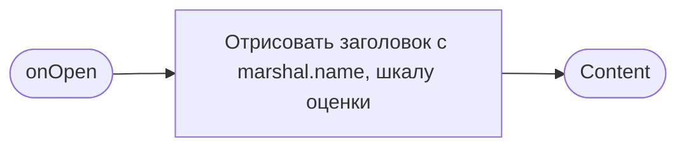
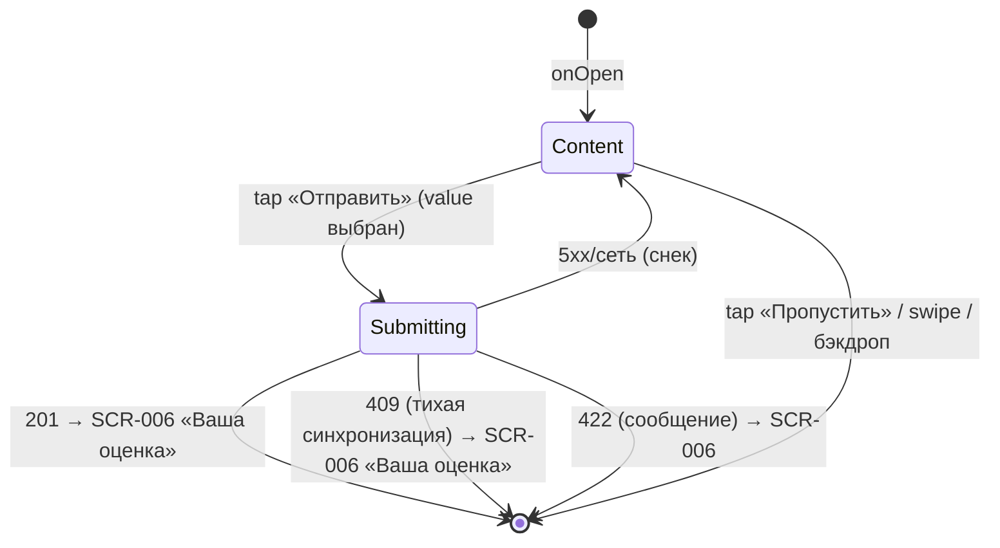

# Оценка маршала

**ID:** BS-004
**Тип:** Bottom Sheet
**Домен:** 04. Мои брони
**Приоритет:** Medium
**Статус:** Черновик
**Функциональные блоки:** FB-RATING-001
**Зона авторизации:** АЗ
**Дизайн-макет:** [Figma] — версия 0.1

---

## Содержание

- [История изменений](#история-изменений)
- [Обзор](#обзор)
- [Навигация](#навигация)
- [Входные данные](#входные-данные)
- [Применяемые логики](#применяемые-логики)
- [Свойства Bottom Sheet](#свойства-bottom-sheet)
- [Инициализация](#инициализация)
- [Используемые запросы](#используемые-запросы)
- [Макет экрана](#макет-экрана)
- [Элементы экрана](#элементы-экрана)
- [Состояния экрана](#состояния-экрана)
- [Действия пользователя](#действия-пользователя)
- [Связанные требования](#связанные-требования)
- [Критерии приёмки](#критерии-приёмки)

---

## История изменений

| Релиз | ТЗ | Описание изменений |
|-------|-----|-------------------|
| — | — | Первоначальная документация |

---

## Обзор

Необязательная однократная оценка маршала после завершённого заезда, без редактирования
после отправки.

### User Story

> Как клиент, я хочу оценить маршала после заезда,
> чтобы поделиться впечатлением от инструктора.

### Бизнес-ценность

- Обратная связь по маршалам для владельца центра (мотивация «звёзд», развитие новеньких).
- Средний рейтинг помогает другим клиентам выбирать заезд.

---

## Навигация

### Входящая (откуда открывается)

| Источник | Триггер | Условие | Передаваемые параметры |
|----------|---------|---------|--------------------------|
| [SCR-006 Детали брони](SCR-006-booking-details.md) | «Оценить маршала» | `completed_locally = true`, оценка ещё не отправлена | `booking_id`, `marshal_id`, `marshal.name` |

### Исходящая (куда ведёт)

| Назначение | Триггер | Передаваемые параметры |
|------------|---------|--------------------------|
| [SCR-006 Детали брони](SCR-006-booking-details.md) | «Отправить» (успех) | — (SCR-006 переключается в состояние «Ваша оценка») |
| [SCR-006 Детали брони](SCR-006-booking-details.md) | «Пропустить» | — (без изменений) |

---

## Входные данные

| Название | Тип | Возможные значения | Описание |
|----------|-----|---------------------|----------|
| `booking_id` | Параметр перехода | UUID | Бронь, к которой привязывается оценка |
| `marshal_id` | Параметр перехода | UUID | Оцениваемый маршал |
| `marshal.name` | Параметр перехода | string | Для заголовка шторки |

---

## Применяемые логики

| Логика | Элемент/Триггер | Описание |
|--------|------------------|----------|
| [LOGIC-005 Оценка маршала](../09-logic/LOGIC-005-marshal-rating.md) | «Отправить» | `POST /ratings`, обработка конфликтов |

---

## Свойства Bottom Sheet

| Свойство | Значение |
|----------|----------|
| Высота | По контенту |
| Закрытие свайпом | Да |
| Закрытие по тапу вне области | Да |
| Затемнение фона | Да |
| Кнопка закрытия | Нет (закрытие через «Пропустить»/свайп/бэкдроп) |

---

## Инициализация

### Диаграмма загрузки



Запросов к API при открытии нет.

---

## Используемые запросы

### createRating

**Тип:** REST
**Метод:** POST
**Спецификация:** `openapi.yaml` → `createRating` (`/ratings`)

**Триггер:** Тап «Отправить».

Полное описание параметров и обработки ответов — см.
[LOGIC-005 §API запросы](../09-logic/LOGIC-005-marshal-rating.md#api-запросы).

---

## Макет экрана

### Структура

```
┌──────────────────────────────────────┐
│  ▭   Оцените маршала                  │
│  Иван вёл ваш заезд 5 июля            │
│  ★ ★ ★ ★ ☆                            │
│  Комментарий (необязательно)          │
│  [        Отправить        ]          │
│  [        Пропустить         ]        │
└──────────────────────────────────────┘
```

### Компоненты

| Компонент | Описание | Обязательность |
|-----------|----------|------------------|
| Заголовок | «Как прошёл заезд с {marshal.name}?» | Да |
| Шкала оценки | 1–5 звёзд | Да |
| Поле комментария | Опционально, ≤ 500 символов | Да (поле есть, заполнение опционально) |
| «Отправить» | Primary CTA, disabled без оценки | Да |
| «Пропустить» | Secondary CTA | Да |

---

## Элементы экрана

### 1. Оценка

| Элемент | Описание | Источник данных | Валидация | Действие |
|---------|----------|--------------------|-----------|----------|
| Заголовок | «Как прошёл заезд с {marshal.name}?» | `marshal.name` | — | — |
| Шкала оценки | 5 звёзд, тап для выбора | `value` (состояние) | 1..5, обязательна для отправки | Обновление состояния |
| Поле комментария | Текстовое поле | `comment` (состояние) | ≤ 500 символов, опционально | Обновление состояния |
| «Отправить» | Primary CTA | — | — | [LOGIC-005](../09-logic/LOGIC-005-marshal-rating.md) → `POST /ratings` |
| «Пропустить» | Secondary CTA | — | — | Закрыть шторку → SCR-006 без изменений |

**Логика:**
- «Отправить»: [LOGIC-005](../09-logic/LOGIC-005-marshal-rating.md).

**Условия доступности:**
- «Отправить» disabled, пока `value` не выбран (1–5).
- Поле комментария — счётчик символов при приближении к лимиту 500.

---

## Состояния экрана

### Таблица состояний

| Состояние | Условие | Отображение |
|-----------|---------|----------------|
| Content | По умолчанию | Форма оценки |
| Загрузка отправки | Ожидание `createRating` | Лоадер на «Отправить» |
| Error | 409 | Тихая синхронизация в состояние «оценка уже есть» (без явной ошибки, см. LOGIC-005) |
| Error | 422 | Сообщение «Оценка пока недоступна» + закрытие |
| Error (сеть/5xx) | — | Снек, шторка остаётся открытой |

### Диаграмма переходов



---

## Действия пользователя

| Действие | Элемент | Триггер | Результат |
|----------|---------|---------|-----------|
| Выбрать оценку | Звёзды | Tap | Активирует «Отправить» |
| Ввести комментарий | Поле комментария | Type | Обновление состояния |
| Отправить оценку | «Отправить» | Tap | `POST /ratings` → SCR-006 «Ваша оценка» |
| Пропустить | «Пропустить» | Tap | Закрыть без изменений |
| Закрыть без оценки | Swipe / бэкдроп | Swipe down / Tap вне шторки | Эквивалентно «Пропустить» |

---

## Связанные требования

### Функциональные (REQ-FUNC-*)

| ID | Название | Приоритет |
|----|----------|-----------|
| REQ-FUNC-RATE-001 | Необязательная однократная оценка маршала | Medium |
| REQ-FUNC-RATE-003 | Комментарий к оценке — опциональное поле | Low |

### Интеграции (REQ-INT-*)

| ID | Название | Приоритет |
|----|----------|-----------|
| REQ-INT-RATE-001 | `POST /ratings` (createRating) | Medium |

---

## Критерии приёмки

### Позитивные сценарии

| ID | Критерий | Приоритет |
|----|----------|-----------|
| AC-001 | **Дано** выбрана оценка, **Когда** тап «Отправить», **Тогда** оценка сохраняется, шторка закрывается | P1 |
| AC-002 | **Дано** заполнен комментарий ≤ 500 символов, **Когда** отправка, **Тогда** комментарий передаётся вместе с оценкой | P2 |

### Негативные сценарии

| ID | Критерий | Приоритет |
|----|----------|-----------|
| AC-N01 | **Дано** оценка не выбрана, **Когда** попытка тапа «Отправить», **Тогда** кнопка неактивна | P1 |

### Граничные условия

| ID | Критерий | Приоритет |
|----|----------|-----------|
| AC-E01 | **Дано** комментарий превышает 500 символов, **Когда** ввод, **Тогда** ввод далее блокируется на лимите | P2 |
| AC-E02 | **Дано** оценка уже была отправлена ранее (сервер вернул 409), **Когда** повторная отправка, **Тогда** UI переходит в состояние «Ваша оценка» без показа ошибки | P2 |
