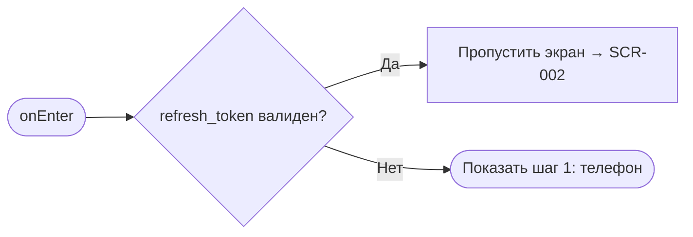
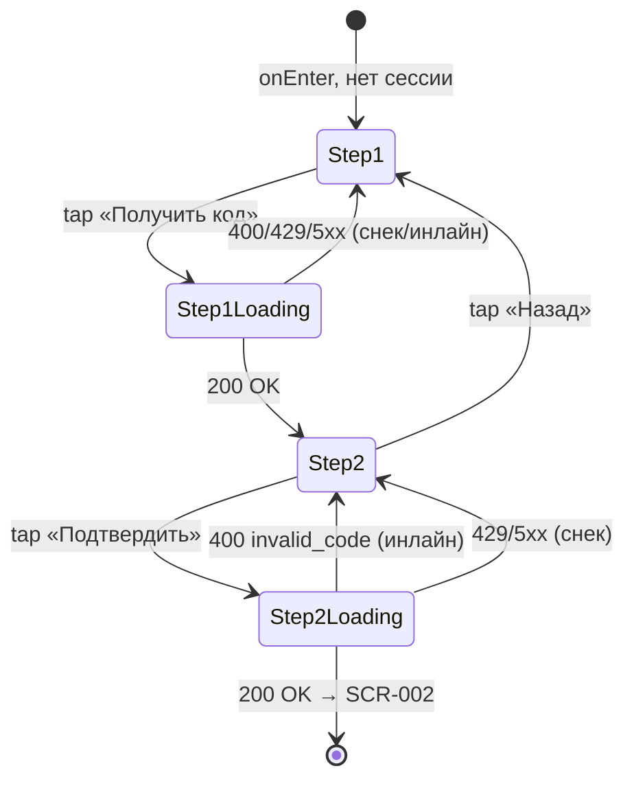

# Регистрация / Вход

**ID:** SCR-001
**Тип:** Экран
**Домен:** 01. Авторизация
**Приоритет:** Critical
**Статус:** Черновик
**Функциональные блоки:** FB-AUTH-001
**Зона авторизации:** НЗ
**Дизайн-макет:** [Figma] — версия 0.1 (см. `SCR-001-registration.md` дизайн-требования)

---

## Содержание

- [История изменений](#история-изменений)
- [Обзор](#обзор)
- [Навигация](#навигация)
- [Входные данные](#входные-данные)
- [Применяемые логики](#применяемые-логики)
- [Инициализация](#инициализация)
- [Используемые запросы](#используемые-запросы)
- [Макет экрана](#макет-экрана)
- [Элементы экрана](#элементы-экрана)
- [Состояния экрана](#состояния-экрана)
- [Действия пользователя](#действия-пользователя)
- [Связанные требования](#связанные-требования)
- [Критерии приёмки](#критерии-приёмки)

---

## История изменений

| Релиз | ТЗ | Описание изменений |
|-------|-----|-------------------|
| — | — | Первоначальная документация |

---

## Обзор

Единственная точка входа неавторизованного пользователя. Двухшаговый flow на одном экране:
телефон → код из SMS → переход в авторизованную зону. Пароль не используется.

### User Story

> Как клиент картинг-центра, часто впервые у трассы и на солнце, я хочу войти по номеру
> телефона без пароля, чтобы быстро попасть к записи на заезд.

### Бизнес-ценность

- Минимальный порог входа снижает отказ на старте воронки записи.
- Устраняет ручную запись через Telegram/доску — единая точка идентификации клиента.
- Основа для «только свои данные» (NFR-6) — все брони и оценки привязаны к телефону.

---

## Навигация

### Входящая (откуда открывается)

| Источник | Триггер | Условие | Передаваемые параметры |
|----------|---------|---------|-------------------------|
| Запуск приложения | Cold start | Нет активной сессии (нет валидного `refresh_token`) | — |
| Любой экран АЗ | Interceptor: `refresh` вернул 401 | Сессия недействительна ([LOGIC-001](../09-logic/LOGIC-001-auth-otp.md)) | — |

### Исходящая (куда ведёт)

| Назначение | Триггер | Передаваемые параметры |
|------------|---------|--------------------------|
| [SCR-002 Список слотов](SCR-002-slot-list.md) | Успешное подтверждение кода | — |

---

## Входные данные

| Название | Тип | Возможные значения | Описание |
|----------|-----|---------------------|----------|
| `refresh_token` | Защищённое хранилище | JWT-строка \| отсутствует | Наличие определяет, показывать ли SCR-001 |

---

## Применяемые логики

| Логика | Элемент/Триггер | Описание |
|--------|------------------|----------|
| [LOGIC-001 Авторизация по телефону (OTP)](../09-logic/LOGIC-001-auth-otp.md) | Кнопки «Получить код» / «Подтвердить» | Запрос и проверка OTP, выпуск и хранение сессии |

---

## Инициализация

### Диаграмма загрузки



### Запросы при открытии

Запросов при открытии экрана нет — источник данных: локальное защищённое хранилище
(`refresh_token`). Экран не показывается, если сессия активна.

---

## Используемые запросы

### requestAuthCode

**Тип:** REST
**Метод:** POST
**Спецификация:** `openapi.yaml` → `requestAuthCode` (`/auth/request-code`)

**Триггер:** Тап «Получить код» (шаг 1).

**Параметры:**

| Параметр | Тип | Обязательность | Источник | Описание |
|----------|-----|-----------------|----------|----------|
| `phone` | string | Да | Поле «Телефон» | E.164, `^\+[1-9]\d{1,14}$` |

**Обработка ответа:** см. [LOGIC-001 §API запросы](../09-logic/LOGIC-001-auth-otp.md#api-запросы).

### verifyAuthCode

**Тип:** REST
**Метод:** POST
**Спецификация:** `openapi.yaml` → `verifyAuthCode` (`/auth/verify-code`)

**Триггер:** Тап «Подтвердить» (шаг 2).

**Параметры:**

| Параметр | Тип | Обязательность | Источник | Описание |
|----------|-----|-----------------|----------|----------|
| `phone` | string | Да | Состояние экрана (шаг 1) | — |
| `code` | string | Да | Поле «Код из SMS» | 4–6 цифр |

**Обработка ответа:** см. [LOGIC-001 §API запросы](../09-logic/LOGIC-001-auth-otp.md#api-запросы).

---

## Макет экрана

### Структура

**Шаг 1 (телефон):**
```
┌───────────────────────────────┐
│  Апекс                        │
│  Войдите, чтобы записаться    │
│  Телефон [ +7 ___ … ]         │
│  Без пароля — вход по номеру  │
│  [     Получить код     ]     │
└───────────────────────────────┘
```

**Шаг 2 (код):**
```
┌───────────────────────────────┐
│  ‹ Назад   Подтверждение       │
│  Код отправлен на +7 …         │
│  Код [ _ _ _ _ ]               │
│  Отправить повторно (00:30)    │
│  [      Подтвердить      ]     │
└───────────────────────────────┘
```

Каркас — [foundations §4.1](../3-design-brief/00-foundations.md). Таб-бар отсутствует.
Фиксированный нижний CTA.

### Компоненты

| Компонент | Описание | Обязательность |
|-----------|----------|-----------------|
| Поле «Телефон» | Маска E.164, телефонная клавиатура | Да |
| Поле «Код из SMS» | OTP, 4–6 цифр | Да |
| Таймер «Отправить повторно» | Обратный отсчёт `resend_after_seconds` | Да |
| Подсказка «Без пароля» | Статический текст под CTA шага 1 | Да |

---

## Элементы экрана

### 1. Шаг 1 — Телефон

| Элемент | Описание | Источник данных | Валидация | Действие |
|---------|----------|-------------------|-----------|----------|
| Поле «Телефон» | Ввод номера | Пользовательский ввод | E.164; пусто → «Введите номер телефона»; неполный формат → «Похоже, номер введён не полностью» | — |
| «Получить код» | Primary CTA | — | — | Валидация → [requestAuthCode](#используемые-запросы) |
| Текст «Без пароля» | Информационная подсказка | Статический текст | — | — |

**Момент валидации:** при потере фокуса поля и повторно при тапе на CTA.

**Логика:**
- «Получить код»: [LOGIC-001](../09-logic/LOGIC-001-auth-otp.md), шаг 1.

**Условия доступности:**
- «Получить код» активна только при валидном телефоне.

### 2. Шаг 2 — Код

| Элемент | Описание | Источник данных | Валидация | Действие |
|---------|----------|-------------------|-----------|----------|
| Поле «Код из SMS» | Ввод OTP | Пользовательский ввод | 4–6 цифр; неверный код (ответ сервера) → «Неверный код. Проверьте и введите ещё раз» | — |
| Таймер «Отправить повторно» | Обратный отсчёт | `resend_after_seconds` из ответа `requestAuthCode` | — | По истечении — повторный вызов `requestAuthCode` |
| «Подтвердить» | Primary CTA | — | — | Валидация → [verifyAuthCode](#используемые-запросы) |
| «‹ Назад» | Возврат к шагу 1 | — | — | Переход на шаг 1, номер телефона сохраняется |

**Момент валидации:** при тапе «Подтвердить»; серверная ошибка `invalid_code` отображается
инлайн под полем немедленно после ответа.

**Логика:**
- «Подтвердить»: [LOGIC-001](../09-logic/LOGIC-001-auth-otp.md), шаг 2.

**Условия доступности:**
- «Подтвердить» активна при заполненном поле кода (4–6 цифр), независимо от валидности —
  финальная проверка на сервере.
- «Отправить повторно» недоступна до истечения таймера.

---

## Состояния экрана

### Таблица состояний

| Состояние | Условие | Отображение |
|-----------|---------|--------------|
| Content (шаг 1) | По умолчанию, нет активной сессии | Форма ввода телефона |
| Content (шаг 2) | Успешный `requestAuthCode` | Форма ввода кода |
| Валидация | Blur/CTA с невалидным значением | Инлайн-ошибка под полем |
| Неверный код | `verifyAuthCode` вернул `invalid_code` | «Неверный код. Проверьте и введите ещё раз» |
| Error (сеть/5xx) | Любой запрос вернул сеть/5xx | Снек + повтор доступен |

Loading/Empty не применимы — экран не загружает список данных с сервера.

### Диаграмма переходов



---

## Действия пользователя

| Действие | Элемент | Триггер | Результат |
|----------|---------|---------|-----------|
| Ввод телефона | Поле «Телефон» | Tap/Type | Валидация по blur |
| Запрос кода | «Получить код» | Tap | Переход к шагу 2, старт таймера |
| Возврат к телефону | «‹ Назад» | Tap | Шаг 1 с сохранённым номером |
| Повторная отправка кода | «Отправить повторно» | Tap (после таймера) | Повторный `requestAuthCode` |
| Подтверждение кода | «Подтвердить» | Tap | Переход на [SCR-002](SCR-002-slot-list.md) |

---

## Связанные требования

### Функциональные (REQ-FUNC-*)

| ID | Название | Приоритет |
|----|----------|-----------|
| REQ-FUNC-AUTH-001 | Вход по телефону + SMS OTP, без пароля | Critical |

### Интеграции (REQ-INT-*)

| ID | Название | Приоритет |
|----|----------|-----------|
| REQ-INT-AUTH-001 | `POST /auth/request-code`, `POST /auth/verify-code` | Critical |

### UI (REQ-UI-*)

| ID | Название | Приоритет |
|----|----------|-----------|
| REQ-UI-AUTH-001 | Нижний CTA не перекрывается системной клавиатурой | High |
| REQ-UI-AUTH-002 | Нет поля пароля на экране | Critical |

---

## Критерии приёмки

### Позитивные сценарии

| ID | Критерий | Приоритет |
|----|----------|-----------|
| AC-001 | **Дано** валидный телефон, **Когда** тап «Получить код», **Тогда** открывается шаг 2 и запускается таймер повтора | P0 |
| AC-002 | **Дано** верный код, **Когда** тап «Подтвердить», **Тогда** открывается SCR-002 | P0 |
| AC-003 | **Дано** активная сессия при запуске, **Когда** запуск приложения, **Тогда** SCR-001 не показывается, сразу открывается SCR-002 | P0 |

### Негативные сценарии

| ID | Критерий | Приоритет |
|----|----------|-----------|
| AC-N01 | **Дано** пустое поле телефона, **Когда** тап «Получить код», **Тогда** «Получить код» неактивна / показана ошибка «Введите номер телефона» | P1 |
| AC-N02 | **Дано** неверный код, **Когда** тап «Подтвердить», **Тогда** показана ошибка «Неверный код. Проверьте и введите ещё раз», поле не сбрасывается | P0 |
| AC-N03 | **Дано** нет сети, **Когда** тап «Получить код»/«Подтвердить», **Тогда** снек "Не удалось загрузить. Проверьте соединение и попробуйте снова" | P1 |

### Граничные условия

| ID | Критерий | Приоритет |
|----|----------|-----------|
| AC-E01 | **Дано** превышено число попыток (429), **Когда** запрос кода, **Тогда** снек «Слишком много попыток. Повторите позже», данные формы сохраняются | P1 |
| AC-E02 | **Дано** таймер повтора активен, **Когда** тап «Отправить повторно» до истечения, **Тогда** действие недоступно | P2 |
