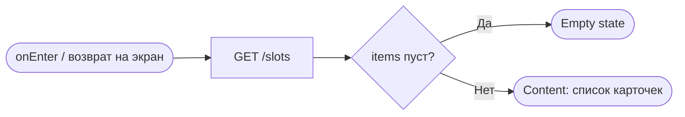
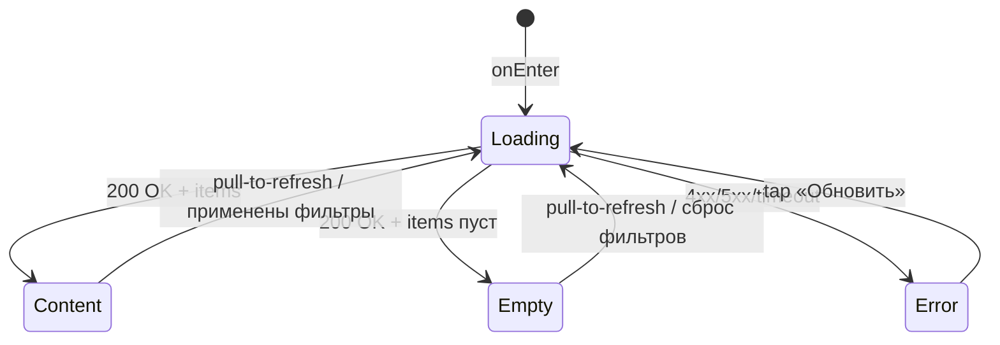

# Список слотов

**ID:** SCR-002
**Тип:** Экран
**Домен:** 02. Заезды
**Приоритет:** Critical
**Статус:** Черновик
**Функциональные блоки:** FB-SLOTS-001
**Зона авторизации:** АЗ
**Дизайн-макет:** [Figma] — версия 0.1

---

## Содержание

- [История изменений](#история-изменений)
- [Обзор](#обзор)
- [Навигация](#навигация)
- [Входные данные](#входные-данные)
- [Применяемые логики](#применяемые-логики)
- [Инициализация](#инициализация)
- [Используемые запросы](#используемые-запросы)
- [Макет экрана](#макет-экрана)
- [Элементы экрана](#элементы-экрана)
- [Состояния экрана](#состояния-экрана)
- [Действия пользователя](#действия-пользователя)
- [Связанные требования](#связанные-требования)
- [Критерии приёмки](#критерии-приёмки)

---

## История изменений

| Релиз | ТЗ | Описание изменений |
|-------|-----|-------------------|
| — | — | Первоначальная документация |

---

## Обзор

Главный экран приложения и стартовая вкладка «Заезды». Каталог слотов на ближайшие 7 дней
по умолчанию (R-027), с фильтрами по дате/трассе/наличию мест/маршалу.

### User Story

> Как клиент, я хочу быстро увидеть список ближайших заездов с ключевыми параметрами,
> чтобы выбрать подходящий и перейти к записи.

### Бизнес-ценность

- Заменяет ручной просмотр доски/переписку в Telegram.
- Прозрачная актуальная доступность мест снижает число обращений «а есть места?».

---

## Навигация

### Входящая (откуда открывается)

| Источник | Триггер | Условие | Передаваемые параметры |
|----------|---------|---------|--------------------------|
| [SCR-001 Регистрация / Вход](SCR-001-registration.md) | Успешный вход | Всегда | — |
| Таб-бар | Тап «Заезды» | Всегда | — |
| [SCR-003 Карточка слота](SCR-003-slot-card.md) | «‹ Назад» | Всегда | Сохранённые фильтры/скролл |
| [BS-001 Фильтры](BS-001-filters.md) | «Применить» | Всегда | Набор фильтров |
| [BS-002 Подтверждение записи](BS-002-booking-success.md) | «Готово» | Всегда | Стек записи закрыт |

### Исходящая (куда ведёт)

| Назначение | Триггер | Передаваемые параметры |
|------------|---------|--------------------------|
| [SCR-003 Карточка слота](SCR-003-slot-card.md) | Тап по карточке слота | `slot_id` |
| [BS-001 Фильтры](BS-001-filters.md) | Тап «Фильтры» | Текущие значения фильтров |
| [SCR-005 Мои бронирования](SCR-005-my-bookings.md) | Таб «Мои брони» | — |

---

## Входные данные

| Название | Тип | Возможные значения | Описание |
|----------|-----|---------------------|----------|
| `filters.date_from`, `filters.date_to` | Состояние (из BS-001) | date-time | По умолчанию `now` / `now + 7 дней` (R-027) |
| `filters.track_config` | Состояние | `novice`, `experienced`, оба, ни одного | Мультивыбор |
| `filters.only_available` | Состояние | `true`/`false` | По умолчанию `false` |
| `filters.instructor_id` | Состояние | массив UUID | Мультивыбор маршалов |

---

## Применяемые логики

| Логика | Элемент/Триггер | Описание |
|--------|------------------|----------|
| [LOGIC-002 Расчёт доступности мест и проката](../09-logic/LOGIC-002-availability-calc.md) | Бейдж «Мест нет» на карточке | Определение `free_seats = 0` с учётом потолка новичковой конфигурации |

---

## Инициализация

### Диаграмма загрузки



### Запросы при открытии

| № | Запрос | Критичный | Зависит от | Условие |
|---|--------|-----------|------------|---------|
| 1 | [listSlots](#listslots) | Да | — | Всегда (с текущими фильтрами, по умолчанию — 7 дней) |

---

## Используемые запросы

### listSlots

**Тип:** REST
**Метод:** GET
**Спецификация:** `openapi.yaml` → `listSlots` (`/slots`)

**Триггер:** Инициализация экрана; применение фильтров на BS-001; pull-to-refresh; подгрузка
следующей страницы при скролле.

**Параметры:**

| Параметр | Тип | Обязательность | Источник | Описание |
|----------|-----|-----------------|----------|----------|
| `date_from` | date-time | Нет | `filters.date_from` или не передаётся (по умолчанию `now`) | Начало периода |
| `date_to` | date-time | Нет | `filters.date_to` или не передаётся (по умолчанию `date_from + 7 дней`) | Конец периода |
| `track_config` | array[string] | Нет | `filters.track_config` | `novice`/`experienced`, мультивыбор |
| `instructor_id` | array[uuid] | Нет | `filters.instructor_id` | Мультивыбор маршалов |
| `only_available` | boolean | Нет | `filters.only_available` | По умолчанию `false` |
| `limit` | integer | Нет | Пагинация (константа приложения, напр. 20) | Размер страницы |
| `offset` | integer | Нет | Пагинация (накопительно при скролле) | Смещение |

**Обработка ответа:**

| Результат | Условие | UI-реакция |
|-----------|---------|------------|
| Загрузка | Первая страница | Скелетоны карточек |
| Загрузка | Догрузка следующей страницы | Индикатор внизу списка |
| Успех | `items` не пуст | Список карточек, сгруппированных по дням, отсортированный по `start_at` |
| Успех | `items` пуст, фильтры по умолчанию | Empty: «Пока нет доступных заездов» (R-027) |
| Успех | `items` пуст, применены фильтры | Empty: «По фильтрам ничего не нашлось. Измените или сбросьте фильтры.» |
| HTTP 4xx/5xx | — | Error state с кнопкой «Обновить» |
| Сеть | Нет соединения | Error state с кнопкой «Обновить» |

---

## Макет экрана

### Структура

```
┌─────────────────────────────────┐
│ Заезды           [⚙ Фильтры •]  │
├─────────────────────────────────┤
│ ┌─────────────────────────────┐ │
│ │ Сб, 5 июля · 14:00          │ │
│ │ Короткая · Маршал: Иван ★4.2│ │
│ │ 2500 ₽    Свободно 3 из 8   │ │
│ └─────────────────────────────┘ │
├─────────────────────────────────┤
│ [Заезды] [Мои брони]            │
└─────────────────────────────────┘
```

Сортировка по `start_at` возрастанию; при длинном списке — секции-заголовки по дням.

### Компоненты

| Компонент | Описание | Обязательность |
|-----------|----------|------------------|
| Хедер с кнопкой «Фильтры» | Индикатор активных фильтров (точка/бейдж) | Да |
| Карточка слота | Вся карточка — единая тап-зона | Да |
| Секции по дням | Заголовки-разделители при длинном списке | Опционально (по решению разработки) |
| Таб-бар | «Заезды» / «Мои брони» | Да |

---

## Элементы экрана

### 1. Карточка слота

| Элемент | Описание | Источник данных | Валидация | Действие |
|---------|----------|--------------------|-----------|----------|
| Дата/время | Крупный текст | `start_at` (`SlotSummary`) | — | — |
| Конфигурация трассы | «Короткая»/«Длинная» | `track_config.name` | — | — |
| Маршал + рейтинг | Имя, звёзды/число | `marshal.name`, `marshal.rating_avg` | — | — |
| Цена | За место | `price_kart` | — | — |
| Места | «Свободно N из M» / «Мест нет» | `free_karts` / `total_karts` (с учётом [LOGIC-002](../09-logic/LOGIC-002-availability-calc.md) для novice) | — | — |
| Карточка целиком | Тап-зона | — | — | Открыть [SCR-003](SCR-003-slot-card.md) с `slot_id`, если места есть; при `free_karts = 0` — карточка отображается некликабельной либо ведёт на SCR-003 с disabled CTA (решение дизайнера, см. SCR-003) |

**Логика:**
- Бейдж мест: [LOGIC-002](../09-logic/LOGIC-002-availability-calc.md).

### 2. Хедер

| Элемент | Описание | Источник данных | Валидация | Действие |
|---------|----------|--------------------|-----------|----------|
| «Фильтры» | Кнопка с индикатором активных фильтров | Состояние `filters` | — | Открыть [BS-001](BS-001-filters.md) |

**Условия доступности:**
- Индикатор активных фильтров отображается, если хотя бы один фильтр отличается от значений
  по умолчанию.

---

## Состояния экрана

### Таблица состояний

| Состояние | Условие | Отображение |
|-----------|---------|----------------|
| Loading | Ожидание `listSlots` (первая страница) | Скелетоны карточек |
| Content | 200 OK + `items` не пуст | Список карточек |
| Empty (по умолчанию) | 200 OK + `items` пуст, фильтры по умолчанию | «Пока нет доступных заездов» |
| Empty (фильтры) | 200 OK + `items` пуст, применены фильтры | «По фильтрам ничего не нашлось. Измените или сбросьте фильтры.» |
| Error | 4xx/5xx/сеть | Error state + «Обновить» |

### Диаграмма переходов



---

## Действия пользователя

| Действие | Элемент | Триггер | Результат |
|----------|---------|---------|-----------|
| Открыть карточку | Карточка слота | Tap | Переход на [SCR-003](SCR-003-slot-card.md) |
| Открыть фильтры | «Фильтры» | Tap | Открывается [BS-001](BS-001-filters.md) |
| Обновить список | Список | Pull-to-refresh | Повтор `listSlots` с текущими фильтрами |
| Догрузить список | Список | Scroll до конца | `listSlots` со следующим `offset` |
| Перейти в брони | Таб «Мои брони» | Tap | Переход на [SCR-005](SCR-005-my-bookings.md) |

---

## Связанные требования

### Функциональные (REQ-FUNC-*)

| ID | Название | Приоритет |
|----|----------|-----------|
| REQ-FUNC-SLOTS-001 | Список слотов на 7 дней вперёд по умолчанию | Critical |
| REQ-FUNC-SLOTS-002 | Отображение среднего рейтинга маршала в карточке | Medium |

### Интеграции (REQ-INT-*)

| ID | Название | Приоритет |
|----|----------|-----------|
| REQ-INT-SLOTS-001 | `GET /slots` (listSlots) | Critical |

### UI (REQ-UI-*)

| ID | Название | Приоритет |
|----|----------|-----------|
| REQ-UI-SLOTS-001 | Индикатор активных фильтров в хедере | High |
| REQ-UI-SLOTS-002 | Читаемость чисел (места, цена) при ярком солнце (NFR-1) | High |

---

## Критерии приёмки

### Позитивные сценарии

| ID | Критерий | Приоритет |
|----|----------|-----------|
| AC-001 | **Дано** есть слоты в ближайшие 7 дней, **Когда** открыт экран, **Тогда** показан список, отсортированный по времени старта | P0 |
| AC-002 | **Дано** применён фильтр «только со свободными местами», **Когда** список обновлён, **Тогда** отображаются только слоты с `free_karts > 0` | P1 |

### Негативные сценарии

| ID | Критерий | Приоритет |
|----|----------|-----------|
| AC-N01 | **Дано** ошибка сети, **Когда** открытие экрана, **Тогда** отображается error state с кнопкой «Обновить» | P0 |
| AC-N02 | **Дано** нет слотов по умолчанию, **Когда** открытие экрана, **Тогда** «Пока нет доступных заездов» | P1 |

### Граничные условия

| ID | Критерий | Приоритет |
|----|----------|-----------|
| AC-E01 | **Дано** `free_karts = 0` у слота, **Когда** отображение карточки, **Тогда** показана пометка «Мест нет» | P1 |
| AC-E02 | **Дано** список длиннее одной страницы, **Когда** скролл до конца, **Тогда** подгружается следующая страница без дублей | P2 |
