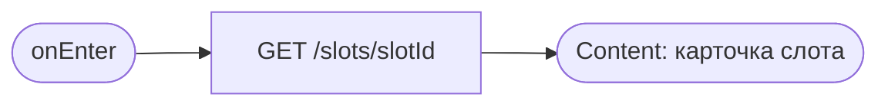
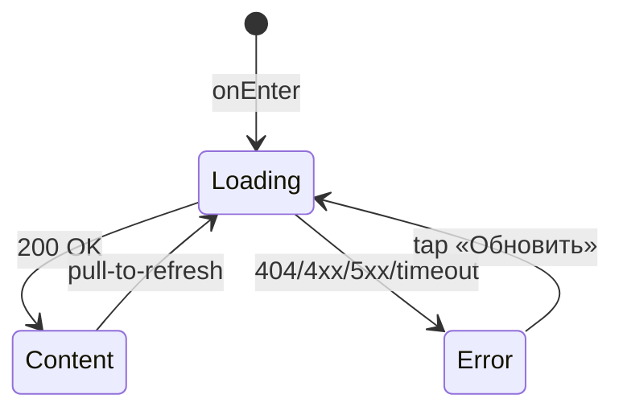

# Карточка слота

**ID:** SCR-003
**Тип:** Экран
**Домен:** 02. Заезды
**Приоритет:** Critical
**Статус:** Черновик
**Функциональные блоки:** FB-SLOTS-004
**Зона авторизации:** АЗ
**Дизайн-макет:** [Figma] — версия 0.1

---

## Содержание

- [История изменений](#история-изменений)
- [Обзор](#обзор)
- [Навигация](#навигация)
- [Входные данные](#входные-данные)
- [Применяемые логики](#применяемые-логики)
- [Инициализация](#инициализация)
- [Используемые запросы](#используемые-запросы)
- [Макет экрана](#макет-экрана)
- [Элементы экрана](#элементы-экрана)
- [Состояния экрана](#состояния-экрана)
- [Действия пользователя](#действия-пользователя)
- [Связанные требования](#связанные-требования)
- [Критерии приёмки](#критерии-приёмки)

---

## История изменений

| Релиз | ТЗ | Описание изменений |
|-------|-----|-------------------|
| — | — | Первоначальная документация |

---

## Обзор

Полная информация об одном заезде для принятия решения о записи. Промежуточный экран между
[SCR-002](SCR-002-slot-list.md) и [SCR-004](SCR-004-booking.md).

### User Story

> Как клиент, я хочу увидеть все детали заезда перед записью (места, экипировка, требования,
> место сбора), чтобы принять осознанное решение.

### Бизнес-ценность

- Снижает число ошибочных записей (не туда, не то время).
- Явные предупреждения о требованиях к участникам снижают конфликты на месте (P4).

---

## Навигация

### Входящая (откуда открывается)

| Источник | Триггер | Условие | Передаваемые параметры |
|----------|---------|---------|--------------------------|
| [SCR-002 Список слотов](SCR-002-slot-list.md) | Тап по карточке | Всегда | `slot_id` |

### Исходящая (куда ведёт)

| Назначение | Триггер | Передаваемые параметры |
|------------|---------|--------------------------|
| [SCR-004 Оформление записи](SCR-004-booking.md) | «Записаться» | `slot_id`, снапшот `Slot` |
| [SCR-002 Список слотов](SCR-002-slot-list.md) | «‹ Назад» | — |

---

## Входные данные

| Название | Тип | Возможные значения | Описание |
|----------|-----|---------------------|----------|
| `slot_id` | Параметр перехода | UUID | Идентификатор слота для загрузки |

---

## Применяемые логики

| Логика | Элемент/Триггер | Описание |
|--------|------------------|----------|
| [LOGIC-002 Расчёт доступности мест и проката](../09-logic/LOGIC-002-availability-calc.md) | Блок «Места», доступность CTA «Записаться» | Лимит мест с учётом потолка новичковой конфигурации |

---

## Инициализация

### Диаграмма загрузки



### Запросы при открытии

| № | Запрос | Критичный | Зависит от | Условие |
|---|--------|-----------|------------|---------|
| 1 | [getSlot](#getslot) | Да | — | Всегда |

---

## Используемые запросы

### getSlot

**Тип:** REST
**Метод:** GET
**Спецификация:** `openapi.yaml` → `getSlot` (`/slots/{slotId}`)

**Триггер:** Инициализация; pull-to-refresh.

**Параметры:**

| Параметр | Тип | Обязательность | Источник | Описание |
|----------|-----|-----------------|----------|----------|
| `slotId` | string(uuid), path | Да | Параметр перехода с SCR-002 | Идентификатор слота |

**Обработка ответа:**

| Результат | Условие | UI-реакция |
|-----------|---------|-------------|
| Загрузка | — | Скелетон карточки |
| Успех | — | Отобразить данные слота |
| HTTP 404 | Слот удалён/не найден | Error state: «Заезд больше не доступен» + «Обновить» (возврат на SCR-002) |
| HTTP 4xx/5xx | — | Error state с кнопкой «Обновить» |
| Сеть | Нет соединения | Error state с кнопкой «Обновить» |

---

## Макет экрана

### Структура

```
┌─────────────────────────────────┐
│ ‹ Назад      Карточка заезда     │
│  Сб, 5 июля · 14:00              │
│  Короткая (новичковая)           │
│  Маршал: Иван · ★ 4.2            │
│  ⚠ Требования: возраст от 12…    │
│  Места: свободно 3 из 8          │
│  Прокат экипировки: 5 шт.        │
│  2500 ₽ за место                 │
│  📍 Место сбора … *               │
│  Адрес центра: … *                │
│  [        Записаться        ]    │
└─────────────────────────────────┘
```
`*` — блок отображается, только если поля присутствуют в ответе API

### Компоненты

| Компонент | Описание | Обязательность |
|-----------|----------|------------------|
| Блок даты/времени | Крупный текст | Да |
| Блок трассы | Название + лейбл новичковая/опытная | Да |
| Блок маршала | Имя + рейтинг | Да |
| Блок предупреждения о требованиях | Из `requirements_text` | Да, если поле не пусто |
| Блок мест | «Свободно N из M» | Да |
| Блок проката | Число свободных комплектов | Да |
| Блок цены | За место | Да |
| Блок «Место сбора и адрес» (foundations §4.4) | Текстовый | Условно — см. GAP G1 |
| CTA «Записаться» | Fixed bottom | Да |

---

## Элементы экрана

### 1. Информация о заезде

| Элемент | Описание | Источник данных | Валидация | Действие |
|---------|----------|--------------------|-----------|----------|
| Дата/время | Крупно | `start_at` | — | — |
| Конфигурация трассы | «Короткая (новичковая)» / «Длинная (опытная)» | `track_config.name` + `track_config.type` | — | — |
| Маршал | Имя + рейтинг | `marshal.name`, `marshal.rating_avg` | — | — |
| Предупреждение о требованиях | Текст, не валидация | `requirements_text` (поле requirements_text из API) | — | — |
| Места | «Свободно N из M» | `free_karts`, `total_karts`, лимит из [LOGIC-002](../09-logic/LOGIC-002-availability-calc.md) | — | — |
| Прокат экипировки | «Свободно N шт.» | `free_rental_gear` | — | — |
| Цена | За место | `price_kart` | — | — |
| Блок «Место сбора / адрес» | Текстовый блок | `meeting_point`, `address` (если поля отсутствуют в ответе, блок скрыт) | — | — |

### 2. CTA

| Элемент | Описание | Источник данных | Валидация | Действие |
|---------|----------|--------------------|-----------|----------|
| «Записаться» | Fixed bottom, primary | — | — | Открыть [SCR-004](SCR-004-booking.md) с `slot_id` |

**Логика:**
- «Записаться»: [LOGIC-002](../09-logic/LOGIC-002-availability-calc.md) — доступность CTA.

**Условия доступности:**
- Enabled: `slot.status = scheduled` И `max_seats > 0` (см. LOGIC-002).
- Disabled + подпись «Мест нет»: `slot.status = scheduled` И `max_seats = 0`.
- Disabled + подпись «Заезд отменён»: `slot.status = cancelled`.

---

## Состояния экрана

### Таблица состояний

| Состояние | Условие | Отображение |
|-----------|---------|----------------|
| Loading | Ожидание `getSlot` | Скелетон блока |
| Content | 200 OK | Стандартный контент |
| Error | 404 | «Заезд больше не доступен» + возврат на SCR-002 |
| Error | 4xx/5xx/сеть | Error state с кнопкой «Обновить» |

### Диаграмма переходов



---

## Действия пользователя

| Действие | Элемент | Триггер | Результат |
|----------|---------|---------|-----------|
| Записаться | «Записаться» | Tap | Переход на [SCR-004](SCR-004-booking.md) |
| Вернуться к списку | «‹ Назад» | Tap | Переход на [SCR-002](SCR-002-slot-list.md) |
| Обновить данные | Экран | Pull-to-refresh | Повтор `getSlot` |

---

## Связанные требования

### Функциональные (REQ-FUNC-*)

| ID | Название | Приоритет |
|----|----------|-----------|
| REQ-FUNC-SLOTS-004 | Полная карточка слота перед записью | Critical |
| REQ-FUNC-SLOTS-005 | Предупреждение о требованиях к участникам без блокирующей валидации | High |

### Интеграции (REQ-INT-*)

| ID | Название | Приоритет |
|----|----------|-----------|
| REQ-INT-SLOTS-003 | `GET /slots/{slotId}` (getSlot) | Critical |

### Данные (REQ-DATA-*)

| ID | Название | Приоритет |
|----|----------|-----------|
| REQ-DATA-SLOTS-001 | `meeting_point`/`address` отсутствуют в текущем контракте `Slot` — блок скрывается при их отсутствии | High |

---

## Критерии приёмки

### Позитивные сценарии

| ID | Критерий | Приоритет |
|----|----------|-----------|
| AC-001 | **Дано** слот доступен, **Когда** открыт экран, **Тогда** отображены все поля слота, CTA «Записаться» активна | P0 |
| AC-002 | **Дано** тап «Записаться» при доступных местах, **Когда** это происходит, **Тогда** открывается SCR-004 | P0 |

### Негативные сценарии

| ID | Критерий | Приоритет |
|----|----------|-----------|
| AC-N01 | **Дано** слот удалён/не найден, **Когда** открытие экрана, **Тогда** отображается сообщение и предлагается вернуться к списку | P1 |
| AC-N02 | **Дано** ошибка сети, **Когда** открытие экрана, **Тогда** error state с кнопкой «Обновить» | P0 |

### Граничные условия

| ID | Критерий | Приоритет |
|----|----------|-----------|
| AC-E01 | **Дано** `free_karts = 0`, **Когда** отображение экрана, **Тогда** CTA disabled с подписью «Мест нет» | P1 |
| AC-E02 | **Дано** `slot.status = cancelled`, **Когда** отображение экрана, **Тогда** CTA disabled с подписью «Заезд отменён» | P1 |
| AC-E03 | **Дано** поля `meeting_point`/`address` отсутствуют в ответе, **Когда** отображение экрана, **Тогда** блок «Место сбора» не показывается | P2 |
