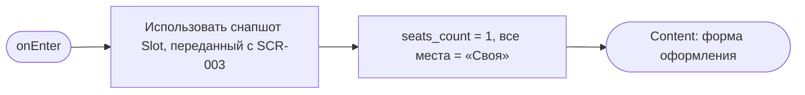
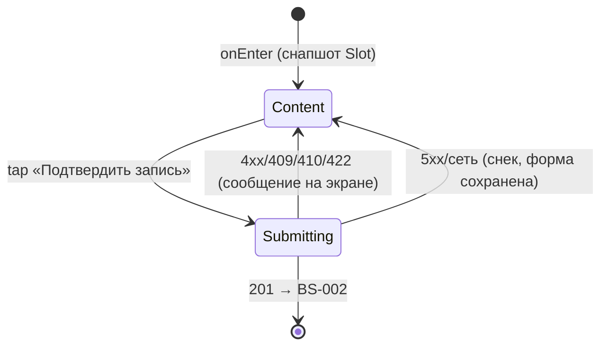

# Оформление записи

**ID:** SCR-004
**Тип:** Экран
**Домен:** 03. Запись
**Приоритет:** Critical
**Статус:** Черновик
**Функциональные блоки:** FB-BOOKING-001
**Зона авторизации:** АЗ
**Дизайн-макет:** [Figma] — версия 0.1

---

## Содержание

- [История изменений](#история-изменений)
- [Обзор](#обзор)
- [Навигация](#навигация)
- [Входные данные](#входные-данные)
- [Применяемые логики](#применяемые-логики)
- [Инициализация](#инициализация)
- [Используемые запросы](#используемые-запросы)
- [Макет экрана](#макет-экрана)
- [Элементы экрана](#элементы-экрана)
- [Состояния экрана](#состояния-экрана)
- [Действия пользователя](#действия-пользователя)
- [Связанные требования](#связанные-требования)
- [Критерии приёмки](#критерии-приёмки)

---

## История изменений

| Релиз | ТЗ | Описание изменений |
|-------|-----|-------------------|
| — | — | Первоначальная документация |

---

## Обзор

Сбор параметров брони: число мест, экипировка на каждое место, итоговая цена. Последний шаг
перед подтверждением записи: SCR-002 → SCR-003 → **SCR-004** → BS-002. Гостей приложение не
спрашивает — только суммарное число мест (FR-7).

### User Story

> Как клиент, я хочу указать число мест и выбрать экипировку (свою или прокатную) на каждое,
> чтобы увидеть точную итоговую цену перед подтверждением.

### Бизнес-ценность

- Явные независимые лимиты мест и проката исключают овербукинг обоих типов ресурса.
- Итоговая цена всегда из API — исключает расхождение с фактическим расчётом центра.

---

## Навигация

### Входящая (откуда открывается)

| Источник | Триггер | Условие | Передаваемые параметры |
|----------|---------|---------|--------------------------|
| [SCR-003 Карточка слота](SCR-003-slot-card.md) | «Записаться» | `free_seats > 0`, слот не отменён | `slot_id`, снапшот `Slot` |

### Исходящая (куда ведёт)

| Назначение | Триггер | Передаваемые параметры |
|------------|---------|--------------------------|
| [BS-002 Подтверждение записи](BS-002-booking-success.md) | Успешная запись | `Booking` (ответ `createBooking`) |
| [SCR-003 Карточка слота](SCR-003-slot-card.md) | «‹ Назад» | — (черновик не сохраняется) |

---

## Входные данные

| Название | Тип | Возможные значения | Описание |
|----------|-----|---------------------|----------|
| `slot_id` | Параметр перехода | UUID | Слот, на который оформляется запись |
| `slot` (снапшот) | Параметр перехода / состояние | `Slot` | Для read-only сводки (дата, трасса, маршал) |
| `seats_count` | Состояние экрана | 1..max_seats | Черновик числа мест |
| `equipment_choice[i]` | Состояние экрана | «своя» \| «прокат» на место | Локальный выбор по месту |

---

## Применяемые логики

| Логика | Элемент/Триггер | Описание |
|--------|------------------|----------|
| [LOGIC-002 Расчёт доступности мест и проката](../09-logic/LOGIC-002-availability-calc.md) | Степпер «Мест», переключатели экипировки | Лимиты `max_seats`/`max_rental` |
| [LOGIC-003 Создание брони](../09-logic/LOGIC-003-create-booking.md) | Кнопка «Подтвердить запись» | Отправка `POST /bookings`, обработка конфликтов |

---

## Инициализация

### Диаграмма загрузки



### Запросы при открытии

Экран не выполняет собственный `GET`-запрос — использует снапшот `Slot`, переданный с
[SCR-003](SCR-003-slot-card.md#используемые-запросы), чтобы не терять контекст между экранами
и избежать лишнего запроса на переходе. Актуальность данных дополнительно проверяется
сервером при отправке (`POST /bookings`) — расхождения обрабатываются по
[LOGIC-003](../09-logic/LOGIC-003-create-booking.md).

---

## Используемые запросы

### createBooking

**Тип:** REST
**Метод:** POST
**Спецификация:** `openapi.yaml` → `createBooking` (`/bookings`)

**Триггер:** Тап «Подтвердить запись».

Полное описание параметров, заголовков (`Idempotency-Key`) и обработки ответов — см.
[LOGIC-003 §API запросы](../09-logic/LOGIC-003-create-booking.md#api-запросы).

---

## Макет экрана

### Структура

```
┌─────────────────────────────────┐
│ ‹  Оформление записи             │
│  Сб 14:00 · Короткая · Иван      │
│  Мест: [ − ] 2 [ + ]             │
│  Место 1: (•) Своя  ( ) Прокат   │
│  Место 2: ( ) Своя  (•) Прокат   │
│  Прокат доступно: 5              │
│  Итого: 5200 ₽ (из API)          │
│  Оплата на месте…                │
│  [      Подтвердить запись   ]   │
└─────────────────────────────────┘
```

### Компоненты

| Компонент | Описание | Обязательность |
|-----------|----------|------------------|
| Read-only сводка слота | Дата/время, трасса, маршал | Да |
| Степпер «Мест» | 1..max_seats | Да |
| Список переключателей «Своя/Прокат» по месту | Динамический, по числу мест | Да |
| Счётчик «Прокат доступно» | Остаток фонда | Да |
| Итоговая цена | Read-only | Да |
| Текст об офлайн-оплате | Статический | Да |
| CTA «Подтвердить запись» | Fixed bottom | Да |

---

## Элементы экрана

### 1. Сводка слота (read-only)

| Элемент | Описание | Источник данных | Валидация | Действие |
|---------|----------|--------------------|-----------|----------|
| Дата/время, трасса, маршал | Одна строка | Снапшот `Slot` | — | — |

### 2. Параметры записи

| Элемент | Описание | Источник данных | Валидация | Действие |
|---------|----------|--------------------|-----------|----------|
| Степпер «Мест» | От 1 до `max_seats` | `seats_count` | `1 ≤ seats_count ≤ max_seats` ([LOGIC-002](../09-logic/LOGIC-002-availability-calc.md)); при достижении границы «+»/«−» блокируется без текста ошибки | Пересчёт списка переключателей экипировки и `max_rental` |
| Переключатель «Своя/Прокат» (на каждое место) | Radio на место | `equipment_choice[i]` | Число выбранных «Прокат» ≤ `max_rental`; при достижении лимита новые «Прокат» блокируются | Пересчёт `rental_gear_count` и «Итого» |
| «Прокат доступно: N» | Остаток фонда проката | `free_rental_gear − текущее число «Прокат»` | — | — |
| «Итого» | Read-only | `price_total`, рассчитывается сервером после отправки; до отправки — справочная оценка на основе `price_kart`/`price_gear_rental` из снапшота, помечена как предварительная | — | — |
| Текст об оплате | Статический | Foundations §6 | — | — |
| «Подтвердить запись» | Primary CTA | — | — | [LOGIC-003](../09-logic/LOGIC-003-create-booking.md) → `POST /bookings` |

**Логика:**
- Степпер и переключатели: [LOGIC-002](../09-logic/LOGIC-002-availability-calc.md).
- «Подтвердить запись»: [LOGIC-003](../09-logic/LOGIC-003-create-booking.md).

**Условия доступности:**
- «Подтвердить запись» активна, если `seats_count ≥ 1` и все переключатели экипировки
  заданы (по умолчанию — «Своя»).

---

## Состояния экрана

### Таблица состояний

| Состояние | Условие | Отображение |
|-----------|---------|----------------|
| Content | По умолчанию (снапшот получен) | Форма оформления |
| Ошибка отправки | `createBooking` вернул 409/410/422/400 | Сообщение на экране согласно [LOGIC-003](../09-logic/LOGIC-003-create-booking.md#шаг-4-обработка-бизнес-конфликтов-409410422) |
| Загрузка отправки | Ожидание ответа `createBooking` | Лоадер на кнопке, форма заблокирована |
| Error (сеть/5xx) | — | Снек, форма доступна для повтора |

Loading/Empty на инициализации не применимы — экран работает со снапшотом без сетевого
запроса при открытии.

### Диаграмма переходов



---

## Действия пользователя

| Действие | Элемент | Триггер | Результат |
|----------|---------|---------|-----------|
| Изменить число мест | Степпер | Tap «+»/«−» | Обновление `seats_count`, пересчёт списка мест |
| Выбрать экипировку | Переключатель на место | Tap | Обновление `equipment_choice[i]` |
| Подтвердить запись | «Подтвердить запись» | Tap | `POST /bookings` → BS-002 или сообщение об ошибке |
| Отменить оформление | «‹ Назад» | Tap | Возврат на SCR-003, черновик не сохраняется |

---

## Связанные требования

### Функциональные (REQ-FUNC-*)

| ID | Название | Приоритет |
|----|----------|-----------|
| REQ-FUNC-BOOK-001 | Выбор числа мест в пределах лимита | Critical |
| REQ-FUNC-BOOK-002 | Независимый выбор экипировки на каждое место | Critical |
| REQ-FUNC-BOOK-003 | Итоговая цена — из API, не пересчитывается локально при расхождении | Critical |
| REQ-FUNC-BOOK-004 | Гости не запрашиваются отдельно (только число мест) | High |

### Интеграции (REQ-INT-*)

| ID | Название | Приоритет |
|----|----------|-----------|
| REQ-INT-BOOK-001 | `POST /bookings` (createBooking) | Critical |

### Данные (REQ-DATA-*)

| ID | Название | Приоритет |
|----|----------|-----------|
| REQ-DATA-BOOK-001 | Переключатели «Своя/Прокат» существуют только в UI для удобства пользователя. При отправке запроса на сервер передаётся единственное число `rental_gear_count` = количество мест, где выбрано «Прокат». Сервер не получает информацию о том, какое именно место выбрано. | High |

---

## Критерии приёмки

### Позитивные сценарии

| ID | Критерий | Приоритет |
|----|----------|-----------|
| AC-001 | **Дано** выбраны допустимые `seats_count`/экипировка, **Когда** тап «Подтвердить запись», **Тогда** создаётся бронь и открывается BS-002 | P0 |
| AC-002 | **Дано** увеличение числа мест, **Когда** это происходит, **Тогда** появляется дополнительный переключатель экипировки по умолчанию «Своя» | P1 |

### Негативные сценарии

| ID | Критерий | Приоритет |
|----|----------|-----------|
| AC-N01 | **Дано** места закончились к моменту отправки, **Когда** сервер вернул `409 slot_full`, **Тогда** показано сообщение с актуальным остатком мест | P0 |
| AC-N02 | **Дано** нет сети, **Когда** тап «Подтвердить запись», **Тогда** снек об отсутствии соединения, форма сохранена | P1 |

### Граничные условия

| ID | Критерий | Приоритет |
|----|----------|-----------|
| AC-E01 | **Дано** `max_seats = 1`, **Когда** попытка увеличить степпер, **Тогда** кнопка «+» неактивна | P2 |
| AC-E02 | **Дано** весь фонд проката занят выбранными местами, **Когда** попытка выбрать «Прокат» ещё для одного места, **Тогда** переключатель заблокирован в состоянии «Своя» | P1 |
