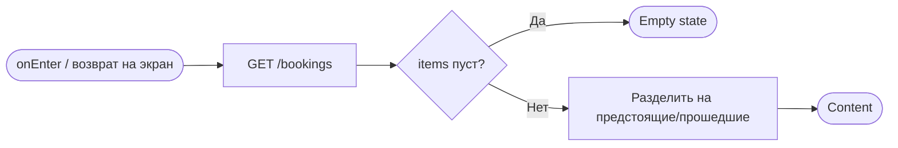
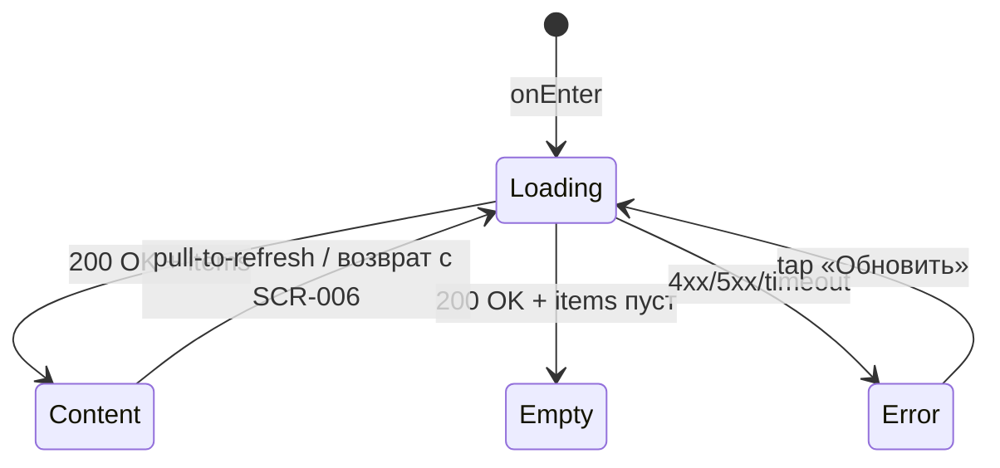

# Мои бронирования

**ID:** SCR-005
**Тип:** Экран
**Домен:** 04. Мои брони
**Приоритет:** Critical
**Статус:** Черновик
**Функциональные блоки:** FB-BOOKING-005
**Зона авторизации:** АЗ
**Дизайн-макет:** [Figma] — версия 0.1

---

## Содержание

- [История изменений](#история-изменений)
- [Обзор](#обзор)
- [Навигация](#навигация)
- [Входные данные](#входные-данные)
- [Применяемые логики](#применяемые-логики)
- [Инициализация](#инициализация)
- [Используемые запросы](#используемые-запросы)
- [Макет экрана](#макет-экрана)
- [Элементы экрана](#элементы-экрана)
- [Состояния экрана](#состояния-экрана)
- [Действия пользователя](#действия-пользователя)
- [Связанные требования](#связанные-требования)
- [Критерии приёмки](#критерии-приёмки)

---

## История изменений

| Релиз | ТЗ | Описание изменений |
|-------|-----|-------------------|
| — | — | Первоначальная документация |

---

## Обзор

Список всех броней клиента, разделённый на **предстоящие** и **прошедшие**. Корневая вкладка
«Мои брони».

### User Story

> Как клиент, я хочу видеть все свои записи — предстоящие и прошедшие — в одном месте,
> чтобы контролировать свои планы и историю посещений.

### Бизнес-ценность

- Единая точка правды о бронях клиента вместо переписки в Telegram.
- Точка входа для отмены и оценки маршала.

---

## Навигация

### Входящая (откуда открывается)

| Источник | Триггер | Условие | Передаваемые параметры |
|----------|---------|---------|--------------------------|
| Таб-бар | Тап «Мои брони» | Всегда | — |
| [BS-002 Подтверждение записи](BS-002-booking-success.md) | «Мои брони» | Всегда | — |
| Push-уведомление | Тап на уведомление | `type = center_cancelled` \| `type = reminder`, без конкретной брони в payload | — |

### Исходящая (куда ведёт)

| Назначение | Триггер | Передаваемые параметры |
|------------|---------|--------------------------|
| [SCR-006 Детали брони](SCR-006-booking-details.md) | Тап по карточке брони | `booking_id` |
| [SCR-002 Список слотов](SCR-002-slot-list.md) | CTA «Выбрать заезд» (Empty state) | — |

---

## Входные данные

Нет — экран полностью управляется данными из API.

---

## Применяемые логики

| Логика | Элемент/Триггер | Описание |
|--------|------------------|----------|
| [LOGIC-005 Оценка маршала](../09-logic/LOGIC-005-marshal-rating.md) | Разделение на предстоящие/прошедшие | Вычисление `completed_locally` для группировки завершённых активных броней |

---

## Инициализация

### Диаграмма загрузки



### Запросы при открытии

| № | Запрос | Критичный | Зависит от | Условие |
|---|--------|-----------|------------|---------|
| 1 | [listBookings](#listbookings) | Да | — | Всегда |

---

## Используемые запросы

### listBookings

**Тип:** REST
**Метод:** GET
**Спецификация:** `openapi.yaml` → `listBookings` (`/bookings`)

**Триггер:** Инициализация; pull-to-refresh; возврат с SCR-006 после отмены/оценки;
подгрузка при скролле.

**Параметры:**

| Параметр | Тип | Обязательность | Источник | Описание |
|----------|-----|-----------------|----------|----------|
| `status` | array[string] | Нет | Не передаётся — все статусы запрашиваются сразу, группировка на клиенте | `active`, `cancelled`, `late_cancel`, `center_cancelled` |
| `limit` | integer | Нет | Пагинация | — |
| `offset` | integer | Нет | Пагинация | — |

**Обработка ответа:**

| Результат | Условие | UI-реакция |
|-----------|---------|-------------|
| Загрузка | Первая страница | Скелетоны карточек |
| Успех | `items` не пуст | Список, разбитый на «Предстоящие»/«Прошедшие» (сортировка по `slot.start_at`: предстоящие — возрастание, прошедшие — убывание) |
| Успех | `items` пуст | Empty: «У вас пока нет записей» + CTA «Выбрать заезд» |
| HTTP 4xx/5xx | — | Error state с кнопкой «Обновить» |
| Сеть | Нет соединения | Error state с кнопкой «Обновить» |

---

## Макет экрана

### Структура

```
┌─────────────────────────────────┐
│ Мои брони                        │
├─────────────────────────────────┤
│ Предстоящие                      │
│ ┌───────────────────────────┐   │
│ │ [● Активна]                │   │
│ │ 5 июля, 14:00 · Короткая   │   │
│ │ Иван · 2 места · 5200 ₽    │   │
│ └───────────────────────────┘   │
│ Прошедшие                        │
│ ┌───────────────────────────┐   │
│ │ [✓ Завершена]              │   │
│ │ …                          │   │
│ └───────────────────────────┘   │
├─────────────────────────────────┤
│ [Заезды] [Мои брони]            │
└─────────────────────────────────┘
```

### Компоненты

| Компонент | Описание | Обязательность |
|-----------|----------|------------------|
| Секции «Предстоящие»/«Прошедшие» | Заголовки-разделители | Да |
| Карточка брони | Статус-бейдж + сводка | Да |
| Таб-бар | «Заезды»/«Мои брони» | Да |

---

## Элементы экрана

### 1. Карточка брони

| Элемент | Описание | Источник данных | Валидация | Действие |
|---------|----------|--------------------|-----------|----------|
| Статус-бейдж | Текст + форма (не только цвет) | `booking.status` (+ `completed_locally`, [LOGIC-005](../09-logic/LOGIC-005-marshal-rating.md)) | — | — |
| Дата/время | — | `booking.slot.start_at` | — | — |
| Конфигурация трассы | — | `booking.slot.track_config.name` | — | — |
| Маршал | — | `booking.slot.marshal.name` | — | — |
| Число мест | — | `booking.seats_count` | — | — |
| Экипировка (сводка) | «N прокат / M своя» | `booking.rental_gear_count`, `booking.seats_count − rental_gear_count` | — | — |
| Итого | — | `booking.price_total` | — | — |
| Карточка целиком | Тап-зона | — | — | Открыть [SCR-006](SCR-006-booking-details.md) с `booking_id` |

**Статусы бейджа:**

| Статус (API) | Производное | Бейдж |
|--------------|------------|-------|
| `active`, `completed_locally = false` | —          | «Активна» |
| `active`, `completed_locally = true` |   —         | «Завершена» |
| `cancelled` | —          | «Отменена» |
| `late_cancel` | —          | «Поздняя отмена» |
| `center_cancelled` | —          | «Отменён центром» + `cancellation_reason` |

### 2. Empty state

| Элемент | Описание | Источник данных | Валидация | Действие |
|---------|----------|--------------------|-----------|----------|
| Текст «У вас пока нет записей» | — | — | — | — |
| «Выбрать заезд» | CTA | — | — | Переход на [SCR-002](SCR-002-slot-list.md) |

---

## Состояния экрана

### Таблица состояний

| Состояние | Условие | Отображение |
|-----------|---------|----------------|
| Loading | Ожидание `listBookings` | Скелетоны карточек |
| Content | 200 OK + `items` не пуст | Список по секциям |
| Empty | 200 OK + `items` пуст | «У вас пока нет записей» + «Выбрать заезд» |
| Error | 4xx/5xx/сеть | Error state + «Обновить» |

### Диаграмма переходов



---

## Действия пользователя

| Действие | Элемент | Триггер | Результат |
|----------|---------|---------|-----------|
| Открыть детали брони | Карточка | Tap | Переход на [SCR-006](SCR-006-booking-details.md) |
| Перейти к записи | «Выбрать заезд» (Empty) | Tap | Переход на [SCR-002](SCR-002-slot-list.md) |
| Обновить список | Список | Pull-to-refresh | Повтор `listBookings` |
| Перейти к заездам | Таб «Заезды» | Tap | Переход на [SCR-002](SCR-002-slot-list.md) |

---

## Связанные требования

### Функциональные (REQ-FUNC-*)

| ID | Название | Приоритет |
|----|----------|-----------|
| REQ-FUNC-BOOK-005 | Список броней с разделением на предстоящие/прошедшие | Critical |
| REQ-FUNC-BOOK-010 | Отображение статуса «Отменён центром» с причиной | Critical |

### Интеграции (REQ-INT-*)

| ID | Название | Приоритет |
|----|----------|-----------|
| REQ-INT-BOOK-003 | `GET /bookings` (listBookings) | Critical |

---

## Критерии приёмки

### Позитивные сценарии

| ID | Критерий | Приоритет |
|----|----------|-----------|
| AC-001 | **Дано** есть брони, **Когда** открыт экран, **Тогда** список разделён на «Предстоящие»/«Прошедшие» с корректными бейджами | P0 |
| AC-002 | **Дано** брони нет, **Когда** открыт экран, **Тогда** показан Empty state с CTA «Выбрать заезд» | P1 |

### Негативные сценарии

| ID | Критерий | Приоритет |
|----|----------|-----------|
| AC-N01 | **Дано** ошибка сети, **Когда** открытие экрана, **Тогда** error state с кнопкой «Обновить» | P0 |

### Граничные условия

| ID | Критерий | Приоритет |
|----|----------|-----------|
| AC-E01 | **Дано** бронь `center_cancelled`, **Когда** отображение карточки, **Тогда** показаны бейдж и причина отмены | P1 |
