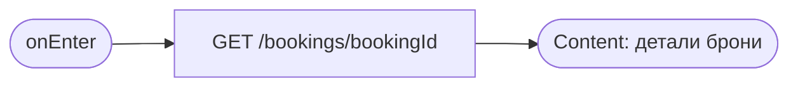
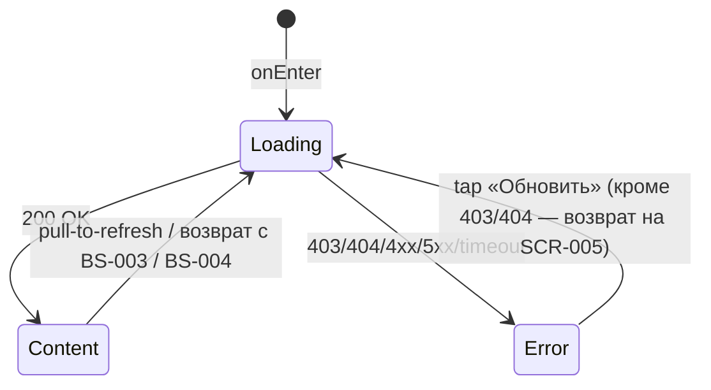

# Детали брони + отмена / оценка

**ID:** SCR-006
**Тип:** Экран
**Домен:** 04. Мои брони
**Приоритет:** Critical
**Статус:** Черновик
**Функциональные блоки:** FB-BOOKING-006
**Зона авторизации:** АЗ
**Дизайн-макет:** [Figma] — версия 0.1

---

## Содержание

- [История изменений](#история-изменений)
- [Обзор](#обзор)
- [Навигация](#навигация)
- [Входные данные](#входные-данные)
- [Применяемые логики](#применяемые-логики)
- [Инициализация](#инициализация)
- [Используемые запросы](#используемые-запросы)
- [Макет экрана](#макет-экрана)
- [Элементы экрана](#элементы-экрана)
- [Состояния экрана](#состояния-экрана)
- [Действия пользователя](#действия-пользователя)
- [Связанные требования](#связанные-требования)
- [Критерии приёмки](#критерии-приёмки)

---

## История изменений

| Релиз | ТЗ | Описание изменений |
|-------|-----|-------------------|
| — | — | Первоначальная документация |

---

## Обзор

Полная информация о брони и два действия: отмена активной брони до старта и оценка маршала
после завершённого заезда.

### User Story

> Как клиент, я хочу увидеть все детали своей брони и, при необходимости, отменить её или
> оценить маршала, чтобы управлять своей записью в одном месте.

### Бизнес-ценность

- Единая точка деструктивных и завершающих действий по брони.
- Прозрачность причины отмены центром снижает недовольство клиента.

---

## Навигация

### Входящая (откуда открывается)

| Источник | Триггер | Условие | Передаваемые параметры |
|----------|---------|---------|--------------------------|
| [SCR-005 Мои бронирования](SCR-005-my-bookings.md) | Тап по карточке брони | Всегда | `booking_id` |
| Push-уведомление | Тап на уведомление | `type = center_cancelled` \| `type = reminder` | `booking_id` |

### Исходящая (куда ведёт)

| Назначение | Триггер | Передаваемые параметры |
|------------|---------|--------------------------|
| [BS-003 Подтверждение отмены](BS-003-cancel-confirm.md) | «Отменить» | `booking_id`, `slot.start_at` |
| [BS-004 Оценка маршала](BS-004-marshal-rating.md) | «Оценить маршала» | `booking_id`, `marshal_id`, `marshal.name` |
| [SCR-005 Мои бронирования](SCR-005-my-bookings.md) | «‹ Назад» | — |

---

## Входные данные

| Название | Тип | Возможные значения | Описание |
|----------|-----|---------------------|----------|
| `booking_id` | Параметр перехода | UUID | Идентификатор брони для загрузки |
| `has_local_rating` | Локальный кэш | `true`/`false` | Отправлена ли оценка в рамках текущей установки |

---

## Применяемые логики

| Логика | Элемент/Триггер | Описание |
|--------|------------------|----------|
| [LOGIC-004 Отмена брони](../09-logic/LOGIC-004-cancel-booking.md) | Кнопка «Отменить» | Переход в BS-003 и обработка результата |
| [LOGIC-005 Оценка маршала](../09-logic/LOGIC-005-marshal-rating.md) | Кнопка «Оценить маршала» / блок «Ваша оценка» | Определение `completed_locally`, доступность оценки |

---

## Инициализация

### Диаграмма загрузки



### Запросы при открытии

| № | Запрос | Критичный | Зависит от | Условие |
|---|--------|-----------|------------|---------|
| 1 | [getBooking](#getbooking) | Да | — | Всегда |

---

## Используемые запросы

### getBooking

**Тип:** REST
**Метод:** GET
**Спецификация:** `openapi.yaml` → `getBooking` (`/bookings/{bookingId}`)

**Триггер:** Инициализация; pull-to-refresh; возврат с BS-003/BS-004.

**Параметры:**

| Параметр | Тип | Обязательность | Источник | Описание |
|----------|-----|-----------------|----------|----------|
| `bookingId` | string(uuid), path | Да | Параметр перехода | Идентификатор брони |

**Обработка ответа:**

| Результат | Условие | UI-реакция |
|-----------|---------|-------------|
| Загрузка | — | Скелетон блока |
| Успех | — | Отобразить детали |
| HTTP 403 | Бронь принадлежит другому клиенту | Error state, возврат на SCR-005 |
| HTTP 404 | Бронь не найдена | Error state, возврат на SCR-005 |
| HTTP 4xx/5xx | — | Error state с кнопкой «Обновить» |
| Сеть | Нет соединения | Error state с кнопкой «Обновить» |

---

## Макет экрана

### Структура (активная бронь)

```
┌───────────────────────────────┐
│ ←  Детали брони               │
│  [● Активна]                  │
│  5 июля, 14:00                │
│  Короткая · Маршал: Иван      │
│  2 места · 1 прокат           │
│  Итого 5200 ₽                 │
│  📍 Место сбора … *            │
│  [        Отменить        ]   │
└───────────────────────────────┘
```
`*` — блок отображается, только если поля `meeting_point`/`address` присутствуют в ответе.

### Компоненты

| Компонент | Описание | Обязательность |
|-----------|----------|------------------|
| Статус-бейдж | Текст+форма | Да |
| Блок даты/трассы/маршала | — | Да |
| Блок мест/экипировки | — | Да |
| Блок цены | — | Да |
| Блок «Место сбора / адрес» | Условно (GAP G1) | Условно |
| Блок причины отмены центром | Только для `center_cancelled` | Условно |
| Блок «Ваша оценка» (read-only) | Только после отправки оценки | Условно |
| Нижний CTA (по статусу) | «Отменить» / «Оценить маршала» / нет CTA | Да, вариативно |

---

## Элементы экрана

### 1. Информация о брони

| Элемент | Описание | Источник данных | Валидация | Действие |
|---------|----------|--------------------|-----------|----------|
| Статус | Бейдж + причина при `center_cancelled` | `booking.status`, `booking.cancellation_reason`, `completed_locally` ([LOGIC-005](../09-logic/LOGIC-005-marshal-rating.md)) | — | — |
| Когда | — | `booking.slot.start_at` | — | — |
| Трасса | — | `booking.slot.track_config.name` | — | — |
| Маршал | — | `booking.slot.marshal.name` | — | — |
| Места и экипировка | — | `booking.seats_count`, `booking.rental_gear_count` | — | — |
| Цена | + текст об офлайн-оплате | `booking.price_total` | — | — |
| Место сбора / адрес | Текстовый блок | `booking.slot.meeting_point`, `booking.slot.address` (скрыт при отсутствии) | — | — |
| Дата отмены | Если применимо | `booking.cancelled_at` | — | — |

### 2. Нижний CTA (по статусу)

| Статус | CTA | Условие |
|--------|-----|---------|
| `active`, `completed_locally = false`, до старта | «Отменить» | Всегда |
| `active`, `completed_locally = false`, < 1 ч до старта | «Отменить» + подсказка о поздней отмене | Отображается на BS-003 |
| `active`, `completed_locally = true`, оценки нет | «Оценить маршала» | `has_local_rating = false` |
| `active`, `completed_locally = true`, оценка есть | Блок «Ваша оценка» (read-only) | `has_local_rating = true` |
| `cancelled` / `late_cancel` / `center_cancelled` | CTA скрыт | Всегда |

**Логика:**
- «Отменить»: [LOGIC-004](../09-logic/LOGIC-004-cancel-booking.md).
- «Оценить маршала» / «Ваша оценка»: [LOGIC-005](../09-logic/LOGIC-005-marshal-rating.md).

**Условия доступности:**
- «Отменить» скрыт, если бронь уже отменена в любом статусе или заезд завершён
  (`completed_locally = true`).

---

## Состояния экрана

### Таблица состояний

| Состояние | Условие | Отображение |
|-----------|---------|----------------|
| Loading | Ожидание `getBooking` | Скелетон блока |
| Content | 200 OK | Стандартный контент, вариативный CTA по статусу |
| Error | 403/404 | Сообщение + возврат на SCR-005 |
| Error | 4xx/5xx/сеть | Error state с кнопкой «Обновить» |

### Диаграмма переходов



---

## Действия пользователя

| Действие | Элемент | Триггер | Результат |
|----------|---------|---------|-----------|
| Отменить бронь | «Отменить» | Tap | Открыть [BS-003](BS-003-cancel-confirm.md) |
| Оценить маршала | «Оценить маршала» | Tap | Открыть [BS-004](BS-004-marshal-rating.md) |
| Вернуться к списку | «‹ Назад» | Tap | Переход на [SCR-005](SCR-005-my-bookings.md) |
| Обновить данные | Экран | Pull-to-refresh | Повтор `getBooking` |

---

## Связанные требования

### Функциональные (REQ-FUNC-*)

| ID | Название | Приоритет |
|----|----------|-----------|
| REQ-FUNC-BOOK-006 | Полные детали брони с вариативным CTA по статусу | Critical |
| REQ-FUNC-BOOK-007 | Отмена активной брони | Critical |
| REQ-FUNC-BOOK-011 | Отображение отмены центром с причиной, без CTA записи на слот | Critical |
| REQ-FUNC-RATE-001 | Оценка маршала после завершённого заезда | Medium |

### Интеграции (REQ-INT-*)

| ID | Название | Приоритет |
|----|----------|-----------|
| REQ-INT-BOOK-004 | `GET /bookings/{bookingId}` (getBooking) | Critical |

### Данные (REQ-DATA-*)

| ID | Название | Приоритет |
|----|----------|-----------|
| REQ-DATA-BOOK-002 | `meeting_point`/`address` отсутствуют в контракте — блок скрывается при отсутствии | High |

---

## Критерии приёмки

### Позитивные сценарии

| ID | Критерий | Приоритет |
|----|----------|-----------|
| AC-001 | **Дано** активная бронь до старта, **Когда** открыт экран, **Тогда** показан CTA «Отменить» | P0 |
| AC-002 | **Дано** завершённый заезд без оценки, **Когда** открыт экран, **Тогда** показан CTA «Оценить маршала» | P1 |
| AC-003 | **Дано** оценка уже отправлена, **Когда** открыт экран, **Тогда** показан блок «Ваша оценка» без возможности редактирования | P1 |

### Негативные сценарии

| ID | Критерий | Приоритет |
|----|----------|-----------|
| AC-N01 | **Дано** бронь не найдена/не принадлежит клиенту, **Когда** открытие экрана, **Тогда** показано сообщение и возврат на SCR-005 | P1 |

### Граничные условия

| ID | Критерий | Приоритет |
|----|----------|-----------|
| AC-E01 | **Дано** бронь `center_cancelled`, **Когда** открытие экрана, **Тогда** CTA отмены/оценки скрыты, показан блок причины | P0 |
| AC-E02 | **Дано** заезд уже начался (для активной брони), **Когда** открытие экрана, **Тогда** CTA «Отменить» скрыт (см. [LOGIC-004](../09-logic/LOGIC-004-cancel-booking.md)) | P1 |
