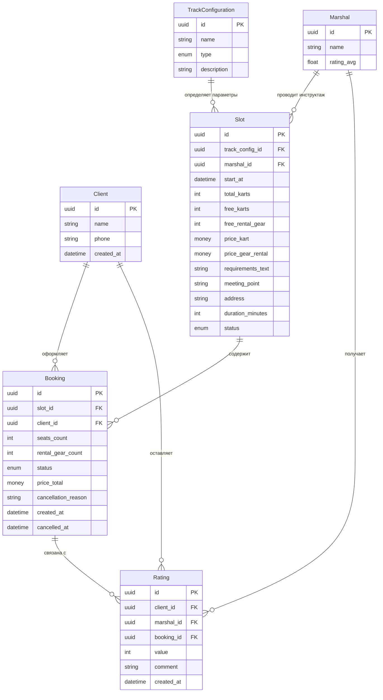
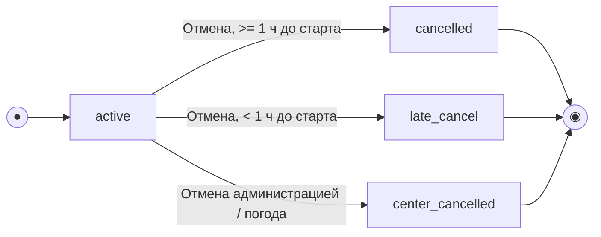

# Схема данных — картинг-центр «Апекс» (клиентское приложение + API)

> Источники: `analysis/4-design/data-model.md`, `analysis/api/openapi.yaml`.
> Данные о слотах, конфигурациях трасс и маршалах формируются в существующей инфраструктуре
> (бэкенд трека) и доступны клиентскому приложению **только для чтения**. Приложение напрямую
> создаёт/изменяет только `Client` (частично), `Booking` и `Rating`.

**Статус:** TODO / черновик для сверки с реализацией · **Дата:** 2026-07-05

---

## 1. Диаграмма связей сущностей (ERD)

---

## 2. Сущности и атрибуты

### 2.1 Client (Клиент) — управляется приложением (частично)

| Атрибут | Тип | Режим | Описание |
| :-- | :-- | :-- | :-- |
| `id` | UUID (PK) | Read-only | Идентификатор клиента |
| `name` | string | Write / Read | Имя; пустое у новых клиентов (`is_new = true`), заполняется через `PATCH /profile` |
| `phone` | string (unique) | Write / Read | E.164, `^\+[1-9]\d{1,14}$`; основной логин, подтверждается SMS OTP |
| `created_at` | datetime | Read-only | Дата регистрации |

### 2.2 TrackConfiguration (Конфигурация трассы) — read-only справочник

| Атрибут | Тип | Режим | Описание |
| :-- | :-- | :-- | :-- |
| `id` | UUID (PK) | Read-only | Идентификатор конфигурации |
| `name` | string (enum: Короткая / Длинная) | Read-only | Отображаемое название |
| `type` | enum: `novice` \| `experienced` | Read-only | `novice` — короткая, лимит группы ≤ 8; `experienced` — длинная, до 14 (по числу картов) |
| `description` | string? | Read-only | Доп. описание трассы |

### 2.3 Marshal (Маршал-инструктор) — read-only справочник + объект оценки

| Атрибут | Тип | Режим | Описание |
| :-- | :-- | :-- | :-- |
| `id` | UUID (PK) | Read-only | Идентификатор маршала |
| `name` | string | Read-only | Имя |
| `rating_avg` | float (0–5) | Read-only | Средний рейтинг по оценкам клиентов |

### 2.4 Slot (Слот расписания / Заезд) — read-only для приложения

| Атрибут | Тип | Режим | Описание |
| :-- | :-- | :-- | :-- |
| `id` | UUID (PK) | Read-only | Идентификатор слота |
| `track_config_id` / `track_config` | FK → TrackConfiguration | Read-only | Ссылка / вложенный объект |
| `marshal_id` / `marshal` | FK → Marshal | Read-only | Ссылка / вложенный объект |
| `start_at` | datetime (UTC) | Read-only | Время старта — источник истины для правила «1 час до отмены» |
| `total_karts` | int | Read-only | Всего картов в заезде (≤14, для `novice` ≤8) |
| `free_karts` | int | Read-only | Свободные карты (расчётное поле) |
| `free_rental_gear` | int | Read-only | Свободные комплекты прокатной экипировки |
| `price_kart` | money (RUB) | Read-only | Цена карта за заезд |
| `price_gear_rental` | money (RUB) | Read-only | Цена проката экипировки за комплект |
| `requirements_text` | string | Read-only | Возрастные/ростовые требования — информационно, не валидируется приложением |
| `status` | enum: `scheduled` \| `cancelled` | Read-only | `cancelled` — отменён центром/по погоде |
| `meeting_point` | string | Read-only | Место сбора (текст) |
| `address` | string | Read-only | Адрес центра |
| `duration_minutes` | int | Read-only | Длительность заезда (включая инструктаж) — используется для вычисления `completed_locally` |

> `SlotSummary` — облегчённая версия для списков (`GET /slots`), содержит те же поля кроме
> `requirements_text` (см. `openapi.yaml`).

### 2.5 Booking (Бронь / Запись) — управляется приложением

| Атрибут | Тип | Режим | Описание |
| :-- | :-- | :-- | :-- |
| `id` | UUID (PK) | Read-only | Идентификатор брони |
| `slot_id` | FK → Slot | Write-once | Слот записи |
| `client_id` | FK → Client | Write-once | Владелец брони |
| `seats_count` | int (1–14) | Write-once | Число мест (включая гостей) |
| `rental_gear_count` | int (0–seats_count) | Write-once | Число прокатных комплектов |
| `status` | enum: `active` \| `cancelled` \| `late_cancel` \| `center_cancelled` | Write / Read | См. жизненный цикл §3 |
| `price_total` | money (RUB) | Read-only | Итог, рассчитан сервером атомарно |
| `cancellation_reason` | string? | Read-only | Только для `center_cancelled` |
| `created_at` | datetime | Read-only | Момент создания |
| `cancelled_at` | datetime? | Read-only | Момент отмены (если была) |
| `rating` | Rating? (вложенно) | Read-only | Оценка по этой брони, если уже оставлена |

### 2.6 Rating (Оценка маршала) — управляется приложением, однократно

| Атрибут | Тип | Режим | Описание |
| :-- | :-- | :-- | :-- |
| `id` | UUID (PK) | Read-only | Идентификатор оценки |
| `client_id` | FK → Client | Write-once | Автор оценки |
| `marshal_id` | FK → Marshal | Write-once | Оцениваемый маршал |
| `booking_id` | FK → Booking | Write-once | Привязка к завершённой брони |
| `value` | int (1–5) | Write-once | Числовая оценка |
| `comment` | string? (≤500) | Write-once | Опциональный комментарий |
| `created_at` | datetime | Read-only | Момент отправки |

---

## 3. Жизненный цикл Booking

| Из | Событие / условие | В | Эффект на слот |
| :-- | :-- | :-- | :-- |
| — | Успешный `POST /bookings` | `active` | `free_karts -= seats_count`; `free_rental_gear -= rental_gear_count` |
| `active` | Отмена, до старта ≥ 1 ч | `cancelled` | Карты и экипировка возвращаются в фонд |
| `active` | Отмена, до старта < 1 ч | `late_cancel` | Карты и экипировка **не** освобождаются; штрафов нет |
| `active` | Слот отменён центром (R-008) | `center_cancelled` | Слот снят; клиенту — push; повторная запись на слот запрещена |
| `cancelled` / `late_cancel` / `center_cancelled` | — (терминальные) | — | Повторная отмена/изменение не выполняются |

**Локальный признак `completed_locally`** (клиентское вычисление, LOGIC-005):
`booking.status == "active" AND now >= slot.start_at + slot.duration_minutes * 60`.
Если `duration_minutes` отсутствует — запасное значение 20 минут (временный костыль, см. §5).

---

## 4. Ключевые инварианты целостности

1. `Slot.free_karts = Slot.total_karts − Σ(Booking.seats_count)` по бронированиям со статусами
   `active` и `late_cancel`.
2. `Slot.total_karts ≤ 8` для `type = novice`, `≤ 14` для `type = experienced`.
3. `Slot.free_rental_gear = исходный_фонд − Σ(Booking.rental_gear_count)` по бронированиям
   `active`/`late_cancel`.
4. `Rating` создаётся только если: заезд состоялся (`now > slot.start_at + duration_minutes`),
   `Booking.status = active`, оценки для этой брони ещё не было (однократность).
5. Только ранняя отмена (`cancelled`) возвращает места/экипировку в слот; `late_cancel` их
   удерживает, штрафов нет.
6. Запись/отмена атомарны на сервере — овербукинг и двойная бронь исключены (R-004, NFR-3).
7. `Idempotency-Key` обязателен для `POST /bookings` — защита от дублей при повторной отправке.

---

## 5. Известные пробелы контракта (для сверки с бэкендом)

| Поле / статус | Проблема | Текущее решение на клиенте |
| :-- | :-- | :-- |
| `completed` (статус брони) | В API нет явного статуса «заезд состоялся» | Вычисляется локально по `start_at + duration_minutes` (LOGIC-005) |
| `GET /ratings?booking_id=` | Есть в API (используется `getRatingByBooking`), но основная защита от повторной оценки — локальный кэш + `409` от `createRating` | После `201` результат кэшируется на устройстве; `409` синхронизирует состояние |
| `meeting_point` / `address` | Могут отсутствовать в ответе (старые данные и т.п.) | Блок UI скрывается при отсутствии полей |

---

## 6. Соответствие ролям и границам скоупа

- **Read-only для клиента:** `TrackConfiguration`, `Marshal`, `Slot` (полностью формируются
  существующей инфраструктурой/бэкендом трека).
- **Read-write через клиентское приложение:** `Client` (частично — имя/телефон), `Booking`,
  `Rating`.
- Данные других клиентов недоступны (`NFR-6`) — сервер фильтрует по `client_id` из токена.
